# Adaptive Learning Management System (LMS) 
# System Design Documentation

This repository collects the architecture and design documents for an **adaptive learning management system (LMS)**—a platform that runs computer-adaptive assessments for many learners at once.

**What the platform does:** Each test session walks a learner through a loop: sign in, answer a question, update an ability estimate, and receive the next item matched to that estimate. That path is kept separate from **video proctoring** so WebRTC media traffic does not slow down answer submission or item selection.

**How it is built:** Services sit behind an API gateway (auth, tests, question bank, admin, proctoring). Persistent data lives in **PostgreSQL**; active session state in **Redis**; proctoring and audit work flows through **Kafka**. Item selection uses a **Rasch 1PL** model, implemented in the standalone [`adaptive-engine`](adaptive-engine/) package.

**What this document covers:** The sections below describe service boundaries, the data model, APIs, concurrency and security, scaling (including targets on the order of 50k concurrent learners), architecture decision records, and the proctoring stack (SFU, recording, ML review).

## Contents

1. [High-Level System Architecture](#1-high-level-system-architecture)
    1. [High-Level Diagram](#a-high-level-diagram)
    2. [Request Paths for Hot Flows](#b-request-paths-for-hot-flows)
    3. [Adaptive Selection Flow](#c-adaptive-selection-flow)
    4. [Summary](#d-summary)
2. [Data Model](#2-data-model)
    1. [Entity Relationship Diagram](#a-entity-relationship-diagram)
    2. [Indexing Strategy on Hot Paths](#b-indexing-strategy-on-hot-paths)
    3. [Database Selection](#c-database-selection)
    4. [Proctoring Entities](#d-proctoring-entities)
3. [Adaptive Algorithm Design](#3-adaptive-algorithm-design)
    1. [Approach Selection](#a-approach-selection)
    2. [Core Concepts](#b-core-concepts)
    3. [Test Termination](#c-test-termination)
    4. [Edge Cases](#d-edge-cases)
    5. [Known Failure Modes](#e-known-failure-modes)
    6. [Advantages of the Rasch Model](#f-advantages-of-the-rasch-model)
4. [API Design](#4-api-design)
    1. [API Style](#a-api-style)
    2. [Submit Answer → Get Next Question](#b-submit-answer-get-next-question)
    3. [Authentication and Authorization Model](#c-authentication-and-authorization-model)
    4. [Proctoring API Endpoints](#d-proctoring-api-endpoints)
    5. [Access Control Summary](#e-access-control-summary)
5. [Concurrency, Integrity & Security](#5-concurrency-integrity-security)
    1. [Preventing Corruption from Concurrent Requests](#a-preventing-corruption-from-concurrent-requests)
    2. [Preventing Previously Submitted Answer Changes via Replay](#b-preventing-previously-submitted-answer-changes-via-replay)
    3. [Handling Browser Closure and Resume Policy](#c-handling-browser-closure-and-resume-policy)
    4. [Top 5 Security Threats and Mitigations](#d-top-5-security-threats-and-mitigations)
    5. [Webcam, Microphone Permission Abuse and Video Stream Tampering](#e-webcam-microphone-permission-abuse-and-video-stream-tampering)
6. [Scaling to 50,000 Concurrent Learners](#6-scaling-to-50000-concurrent-learners)
    1. [50,000 Learners Starting a Test in the Same 5-Minute Window](#a-50000-learners-starting-a-test-in-the-same-5-minute-window)
    2. [Bottlenecks Ranked: Top 3](#b-bottlenecks-ranked-top-3)
    3. [Scaling Plan for 10x Load](#c-scaling-plan-for-10x-load)
    4. [Preventing Question-Bank Leakage at Product and System Level](#d-preventing-question-bank-leakage-at-product-and-system-level)
    5. [Additional Bandwidth and Compute Load from Video Proctoring](#e-additional-bandwidth-and-compute-load-from-video-proctoring)
7. [Architecture Decision Records (3 ADRs)](#7-architecture-decision-records-3-adrs)
    1. [ADR-1: Database Choice (PostgreSQL vs MongoDB)](#adr-1-database-choice-postgresql-vs-mongodb)
    2. [ADR-2: Adaptive Algorithm Choice](#adr-2-adaptive-algorithm-choice)
    3. [ADR-3: Auth and Session Strategy](#adr-3-auth-and-session-strategy)
8. [Video Proctoring System Design](#8-video-proctoring-system-design)
    1. [Goals](#a-goals)
    2. [High-Level Architecture](#b-high-level-architecture)
    3. [Why SFU Instead of MCU](#c-why-sfu-instead-of-mcu)
    4. [WebRTC Connection Flow](#d-webrtc-connection-flow)
    5. [Recording Strategy](#e-recording-strategy)
    6. [ML Detection Pipeline](#f-ml-detection-pipeline)
    7. [Severity Scoring](#g-severity-scoring)
    8. [Reviewer Workflow](#h-reviewer-workflow)
    9. [Privacy and Compliance](#i-privacy-and-compliance)
    10. [Retention Policy](#j-retention-policy)
    11. [Failure Handling](#k-failure-handling)
    12. [Scaling Considerations](#l-scaling-considerations)
    13. [Security Considerations](#m-security-considerations)
    14. [Summary](#summary-2)

---

<a id="1-high-level-system-architecture"></a>

# 1. High-Level System Architecture

The adaptive LMS is designed as a set of independently scalable services. The core test-taking path is separated from video proctoring so that high-bandwidth media traffic does not slow down answer submission or adaptive question selection.

<a id="a-high-level-diagram"></a>

## a. High-Level Diagram

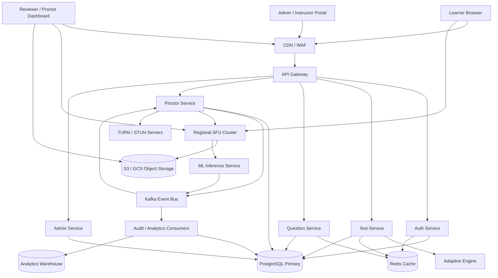


---

### Core Services

#### API Gateway

The API Gateway is the public entry point for REST APIs.

Responsibilities:

- TLS termination
- JWT validation
- Rate limiting
- Request routing
- Request size limits
- Basic request validation
- WAF integration

---

#### Auth Service

Handles authentication and authorization.

Responsibilities:

- Login
- JWT issuing
- Refresh token rotation
- Role loading
- Auth session revocation

Data stores:

- PostgreSQL for users, roles, refresh token hashes
- Redis for short-lived auth/session cache

---

#### Test Service

Owns the test-taking lifecycle.

Responsibilities:

- Start test session
- Resume test session
- Submit answer
- Lock active session during answer submission
- Update ability estimate
- Complete or terminate test session

Data stores:

- PostgreSQL for TestSessions and Answers
- Redis for cached test configuration

---

#### Question Service

Owns question-bank access and versioning.

Responsibilities:

- Load published question versions
- Filter questions by test
- Select candidate questions by difficulty
- Enforce no-repeat rules
- Track question exposure

Data stores:

- PostgreSQL for Questions and QuestionVersions
- Redis for hot question pools and exposure counters

---

#### Adaptive Engine

A stateless module used by Test Service.

Responsibilities:

- Estimate learner ability
- Calculate probability of correctness
- Update standard error
- Decide termination
- Select next question difficulty band

The engine uses the Rasch 1PL IRT model.

---

#### Proctor Service

Owns proctoring session lifecycle.

Responsibilities:

- Create ProctoringSession
- Record consent
- Allocate SFU resources
- Issue WebRTC and TURN credentials
- Receive heartbeat events
- Consume ML-generated proctoring events
- Notify reviewer dashboard

Data stores:

- PostgreSQL for proctoring metadata
- Kafka for proctoring event streams
- Object storage for video chunks

---

#### ML Inference Service

Processes sampled frames and audio from the SFU.

Responsibilities:

- Face detection
- Multiple-face detection
- Gaze estimation
- Object detection
- Audio anomaly detection
- Publish ProctoringEvent records to Kafka

Compute:

- GPU-backed inference workers
- Batched frame processing

---

#### Reviewer / Proctor Dashboard

Internal UI for human review.

Responsibilities:

- View flagged sessions
- Review video timeline
- Confirm or dismiss proctoring events
- Terminate live sessions if allowed
- Add reviewer notes

---

### Data Stores

#### PostgreSQL

Primary transactional database.

Stores:

- Users
- Roles
- Questions
- QuestionVersions
- Tests
- TestSessions
- Answers
- AuditLog
- ProctoringSession
- VideoChunk metadata
- ProctoringEvent metadata
- ProctoringRule

Used because the core LMS requires strong consistency, row-level locking, transactions, and relational integrity.

---

#### Redis

Low-latency cache.

Stores:

- Test configuration cache
- Hot question pools
- Question exposure counters
- Rate-limit counters
- Short-lived auth/session data

Redis reduces repeated PostgreSQL reads during exam windows.

---

#### Kafka

Event bus for asynchronous processing.

Topics:

- `audit-events`
- `proctoring-events`
- `analytics-events`
- `question-exposure-events`

Used for:

- Decoupling ML inference from proctoring persistence
- Writing audit logs asynchronously
- Feeding analytics and leak detection pipelines
- Supporting reviewer queue generation

---

#### Object Storage

Stores raw video data and snapshots.

Examples:

- S3
- Google Cloud Storage

Stores:

- 5-second video chunks
- Proctoring event frame snapshots
- Optional screen recording chunks

Object storage uses lifecycle rules to delete raw video after the retention period.

---

#### Analytics Warehouse

Used for offline reporting.

Stores:

- Exam analytics
- Question performance statistics
- Difficulty drift detection
- Leakage detection signals
- Institution-level reports

---

### External Dependencies

#### SFU Cluster

Selective Forwarding Unit cluster, such as mediasoup or Janus.

Responsibilities:

- Accept WebRTC media from learner browsers
- Forward streams to recording pipeline
- Forward sampled frames to ML inference
- Forward live streams to reviewer dashboard

---

#### TURN / STUN Servers

Used for WebRTC NAT traversal.

Example:

- Coturn

Responsibilities:

- Help learners behind NAT or corporate firewalls connect to SFU
- Provide relay fallback when peer connectivity fails

---

#### Object Storage Provider

Examples:

- AWS S3
- Google Cloud Storage

Responsibilities:

- Durable storage of video chunks
- Pre-signed URL access for reviewers
- Lifecycle-based deletion

---

#### Email / Notification Provider

Used for:

- Account verification
- Exam reminders
- Admin alerts
- Security notifications

---

### Why This Architecture

The architecture separates the system into three independently scalable planes:


| Plane                  | Responsibility                                 | Main Scaling Concern                 |
| ---------------------- | ---------------------------------------------- | ------------------------------------ |
| Core Test Plane        | Start sessions, submit answers, update ability | PostgreSQL write throughput          |
| Proctoring Media Plane | WebRTC streaming, SFU, TURN                    | Bandwidth and SFU capacity           |
| Event/Analytics Plane  | Audit, ML events, leak detection               | Kafka throughput and async consumers |


This separation ensures that heavy video traffic and ML processing do not block the correctness-critical answer submission flow.

---

<a id="b-request-paths-for-hot-flows"></a>

## b. Request Paths for Hot Flows

The two highest-volume and most latency-sensitive flows in the system are:

1. Start Test
2. Submit Answer → Get Next Question

These flows must remain fast even when tens of thousands of learners are active simultaneously.

---

### Hot Flow 1: Start Test

#### Purpose

Creates a new adaptive test session and returns the first question.

API:

```http
POST /api/v1/tests/{test_id}/sessions
```

---

#### Request Path Diagram

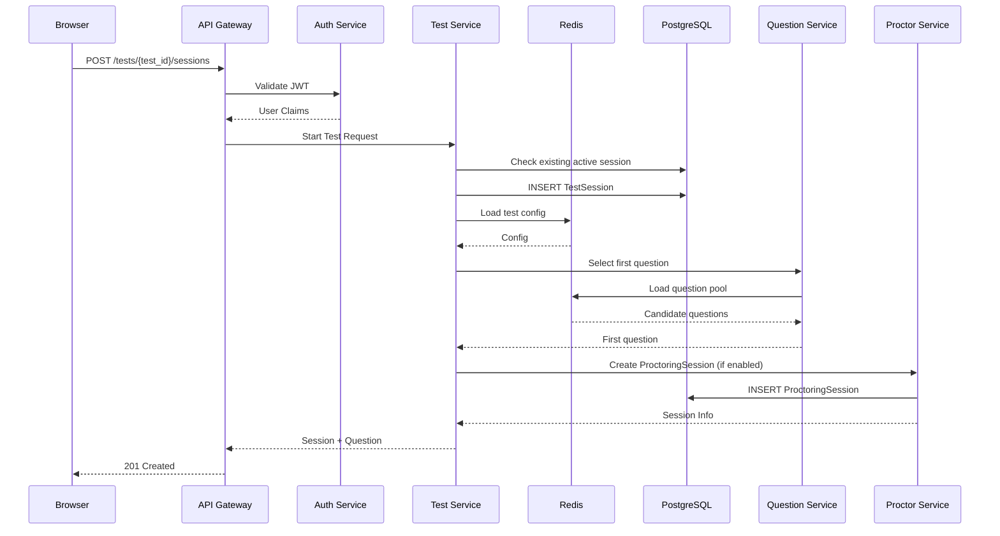


#### Processing Steps

```text
1. Validate JWT.
2. Verify learner can access the test.
3. Check for existing active session.
4. Create TestSession.
5. Load test configuration.
6. Select first adaptive question.
7. Create ProctoringSession if required.
8. Return session and first question.
```

#### Database Operations

Typical writes:

```text
1 TestSession insert
1 AuditLog insert
1 ProctoringSession insert (optional)
```

Typical reads:

```text
Test configuration
Question pool
Question versions
```

Most reads come from Redis.

#### Performance Targets

```text
P50 latency < 500 ms
P95 latency < 1.5 seconds
P99 latency < 3 seconds
```

At:

```text
50,000 learners / 5 minutes
```

Average:

```text
167 start requests/second
```

Burst target:

```text
500 start requests/second
```

---

### Hot Flow 2: Submit Answer → Get Next Question

#### Purpose

This is the most critical transactional workflow.

API:

```http
POST /api/v1/test-sessions/{session_id}/answers
```

The system must:

```text
Validate answer
Update ability estimate
Update standard error
Select next adaptive question
Return next question
```

all within one transaction.

#### Request Path Diagram

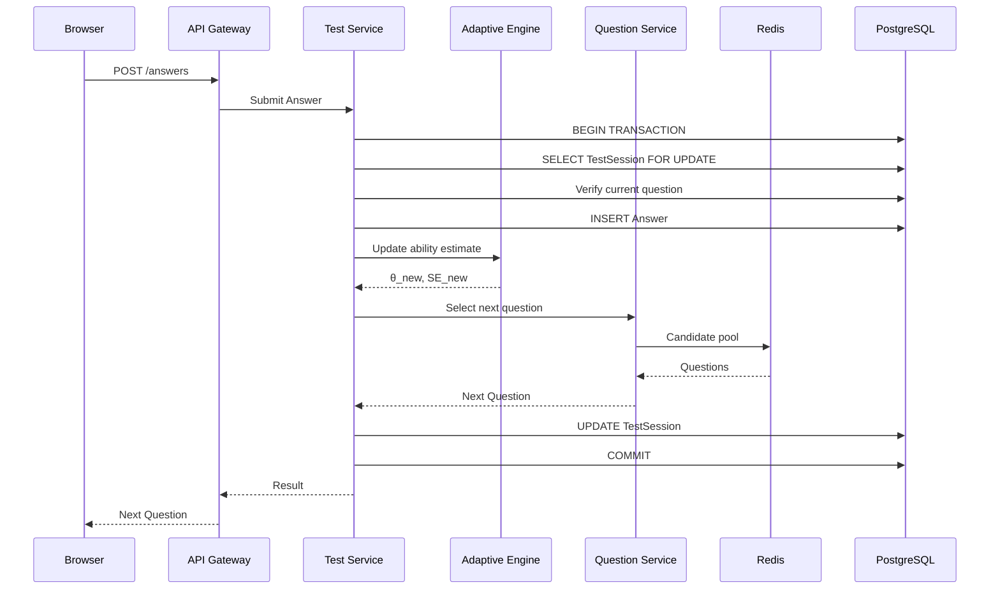


#### Processing Steps

```text
1. Validate JWT.
2. Verify learner owns session.
3. Begin transaction.
4. Lock TestSession row.
5. Verify active question.
6. Check duplicate answer.
7. Insert Answer.
8. Update ability estimate.
9. Calculate standard error.
10. Select next adaptive question.
11. Update TestSession.
12. Commit transaction.
13. Return next question.
```

#### Concurrency Protection

To prevent corruption:

```sql
SELECT *
FROM test_sessions
WHERE id = $1
FOR UPDATE;
```

Only one answer request may modify a session at a time.

Additional protections:

```text
Unique answer constraint
Idempotency key
Question ownership validation
Current-question validation
```

#### Database Operations per Submission

Synchronous writes:

```text
1 Answer insert
1 TestSession update
```

Asynchronous:

```text
1 Audit event → Kafka
```

Reads:

```text
Current session
Question metadata
Question pool
```

#### Throughput Estimate

Assumption:

```text
50,000 learners
1 answer every 30 seconds
```

Answer rate:

```text
50,000 / 30

≈ 1,667 submissions/second
```

Critical write path:

```text
1,667 × 2

≈ 3,334 writes/sec
```

This is the most important transactional workload in the entire system.

---

<a id="c-adaptive-selection-flow"></a>

## c. Adaptive Selection Flow

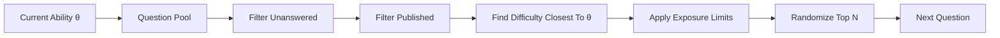


### What Are Exposure Limits?

Exposure limits are a protection mechanism that prevents the same question from being shown too frequently across the entire learner population.

Without exposure control, the adaptive algorithm would repeatedly choose the statistically "best" question for a given ability level.

For example:

```text
Current ability θ = 1.4

Question A difficulty = 1.4
Question B difficulty = 1.5
Question C difficulty = 1.3
```

If Question A always provides the highest information value, the adaptive engine may serve it to thousands of learners.

This creates a major question-bank leakage risk.

---

#### Example Without Exposure Limits

Assume:

```text
50,000 learners
Ability range around θ = 1.4
```

Question:

```text
Q123
difficulty = 1.4
```

Adaptive engine behavior:

```text
Q123 selected for 40,000 learners
```

If one learner screenshots Q123 and shares it:

```text
40,000 learners may benefit from leaked content.
```

This is unacceptable for a high-stakes assessment.  

---

#### Example With Exposure Limits

Each question tracks:

```text
exposure_count
```

and:

```text
max_exposure
```

Example:

```text
Question Q123

difficulty = 1.4

exposure_count = 4,998

max_exposure = 5,000
```

After two more deliveries:

```text
exposure_count = 5,000
```

The question becomes ineligible:

```text
Q123 removed from candidate pool
```

The engine must then choose another question with similar difficulty.

---

#### Candidate Selection Flow

```text
Current Ability θ = 1.4

Candidate Questions:

Q101 difficulty = 1.2 exposure = 1200
Q102 difficulty = 1.3 exposure = 3100
Q103 difficulty = 1.4 exposure = 5000 (LIMIT REACHED)
Q104 difficulty = 1.5 exposure = 2700
Q105 difficulty = 1.6 exposure = 1800
```

After exposure filtering:

```text
Q103 removed
```

Remaining candidates:

```text
Q101
Q102
Q104
Q105
```

The engine then selects from the remaining candidates closest to the learner's ability.

---

### Why Randomize Top N?

Even with exposure limits, always selecting the single closest question can create hot spots.

Instead:

```text
1. Find Top 20 closest questions.
2. Remove over-exposed questions.
3. Randomly select one.
```

Example:

```text
Closest Questions:

Q102
Q104
Q105
Q108
Q110
...
```

The system randomly selects one of these.

Benefits:

- Reduces leakage.
- Improves question-bank utilization.
- Produces more stable exposure distribution.
- Prevents a small number of questions from being overused.

#### Database Representation

Example fields:

```sql
question_versions
(
    id UUID,
    difficulty FLOAT,
    exposure_count BIGINT,
    max_exposure BIGINT
)
```

Query:

```sql
SELECT *
FROM question_versions
WHERE exposure_count < max_exposure
ORDER BY ABS(difficulty - :ability)
LIMIT 20;
```

The adaptive engine then randomly chooses one question from those 20 candidates.

#### Impact on Security

Assume:

```text
Question bank size = 20,000
Learners = 50,000
Exposure limit = 5,000
```

Without exposure control:

```text
A single question may be shown 50,000 times.
```

With exposure control:

```text
A single question may be shown at most 5,000 times.
```

Reduction:

```text
50,000 → 5,000

90% lower maximum exposure
```

Exposure limits are therefore one of the primary defenses against question-bank leakage and are used together with adaptive selection, randomization, watermarking, and question retirement.

---

<a id="d-summary"></a>

## d. Summary


| Flow                          | Main Services                                                   | Main Database Action           | Primary Bottleneck       |
| ----------------------------- | --------------------------------------------------------------- | ------------------------------ | ------------------------ |
| Start Test                    | API Gateway → Test Service → Question Service → Proctor Service | Create TestSession             | Session creation burst   |
| Submit Answer → Next Question | API Gateway → Test Service → Adaptive Engine → Question Service | Answer insert + session update | Transactional write path |


These two flows are the highest-priority paths in the system and therefore receive the strongest guarantees around latency, correctness, concurrency control, and scalability.

```

```

<a id="2-data-model"></a>

# 2. Data Model

<a id="a-entity-relationship-diagram"></a>

## a. Entity Relationship Diagram

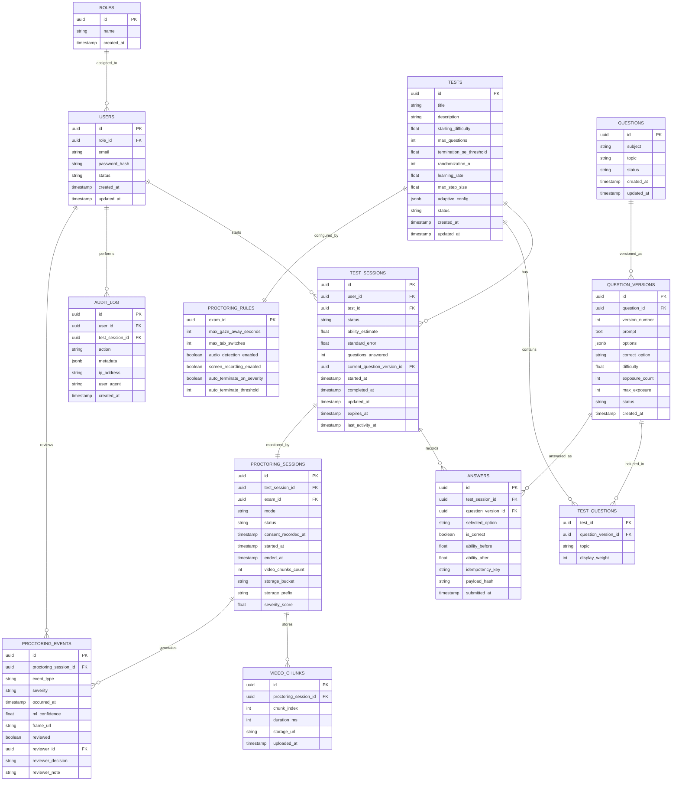


### Design Notes

#### Question Versioning

Questions are immutable once published.

If an administrator modifies a question:

- A new `QuestionVersion` record is created.
- Existing learner attempts continue referencing the original version.
- Historical exam results remain reproducible and auditable.
- Difficulty calibration is maintained per version.
- Exposure tracking is maintained per version.

Answers reference `QuestionVersions`, not only `Questions`, so the system always knows exactly which version of the question the learner saw.

---

#### Adaptive State Storage

`TestSessions` stores the learner's active adaptive state:

- Current ability estimate, θ
- Standard Error, SE
- Number of answered questions
- Current active question
- Session status

This allows:

- Real-time adaptive question selection
- Confidence-based termination
- Safe resume after disconnect
- Protection against stale submissions

The server remains the source of truth for adaptive state.

---

#### Adaptive Test Configuration

Adaptive configuration is stored at the `Tests` level because it controls the behavior of the whole exam.

Examples:

- `starting_difficulty`
- `max_questions`
- `termination_se_threshold`
- `randomization_n`
- `adaptive_config`

Example `adaptive_config`:

```json
{
  "learning_rate": 0.3,
  "max_step_size": 0.75,
  "min_ability": -4,
  "max_ability": 4,
  "exposure_limit_default": 5000
}
```

`randomization_n` controls how many eligible questions are considered before randomly selecting the next question.

For example, if `randomization_n = 20`, the adaptive engine finds the 20 closest eligible questions to the learner's current ability estimate and randomly selects one.

---

#### Question Exposure Control

Each `QuestionVersion` stores:

- `exposure_count`
- `max_exposure`

Exposure is tracked per question version because a new version may have different wording, options, difficulty, or leakage history.

Before selecting the next question, the adaptive engine excludes questions where:

```text
exposure_count >= max_exposure
```

This prevents the same high-information question from being shown too often.

Exposure control reduces:

- Question-bank leakage
- Overuse of statistically ideal questions
- Predictability during mass exam windows
- Risk from screenshot sharing

---

#### Answer Tracking and Replay Protection

`Answers` are immutable after submission.

Each answer stores:

- Exact `question_version_id`
- Selected option
- Correctness
- Ability before answer
- Ability after answer
- Idempotency key
- Payload hash
- Submission timestamp

The `idempotency_key` allows safe retries after network failures.

The `payload_hash` helps detect modified replay attempts where a learner reuses the same idempotency key with a different selected answer.

---

#### Session Integrity

Only one request can mutate a test session at a time.

The answer submission flow uses:

- Database transaction
- Row-level locking on `TestSessions`
- Current-question validation
- Unique answer constraints
- Idempotency keys

This prevents:

- Duplicate submissions
- Concurrent state corruption
- Answer replay
- Changing previous answers
- Multiple active sessions for the same learner and test

---

#### Proctoring Architecture

A `TestSession` may have one `ProctoringSession`.

The proctoring subsystem stores:

- Proctoring session lifecycle
- Video chunk metadata
- ML-generated events
- Reviewer decisions
- Severity score
- Exam-specific proctoring rules

Raw video is stored in object storage. PostgreSQL stores only metadata and review records.

This keeps high-volume media storage separate from the core transactional test database.

---

#### Scalability Strategy

The architecture separates the platform into three independently scalable planes:

1. **Assessment Plane**
  - Test sessions
  - Adaptive scoring
  - Question selection
2. **Proctoring Plane**
  - WebRTC streaming
  - SFU infrastructure
  - Video recording
3. **Event Processing Plane**
  - Kafka event streams
  - Audit processing
  - Analytics
  - ML-generated proctoring events

This prevents video-processing workloads from impacting learner-facing assessment performance.

---

#### Audit Logging

`AuditLog` records security-sensitive and compliance-sensitive actions.

Examples:

- Test started
- Test resumed
- Answer submitted
- Test completed
- Session terminated
- Replay rejected
- Duplicate submission rejected
- Authentication events
- Proctoring violations
- Reviewer decisions
- Administrative changes

Audit logs are append-only and retained for investigation and compliance.

<a id="b-indexing-strategy-on-hot-paths"></a>

## b. Indexing Strategy on Hot Paths

The main hot paths are:

1. Start a test
2. Submit answer and get next question
3. Resume an active test session
4. Select the next adaptive question
5. Prevent duplicate or replayed answers
6. Query audit and proctoring review data

The database is PostgreSQL. Indexes are chosen to support these flows while avoiding unnecessary write overhead.

---

### 1. Start Test

When a learner starts a test, the system needs to:

- Validate the learner
- Load test configuration
- Check whether an active session already exists
- Create a `TestSession`
- Select the first question near the starting difficulty

Recommended indexes:

```sql
CREATE UNIQUE INDEX idx_users_email
ON users (email);

CREATE INDEX idx_tests_status
ON tests (status);

CREATE INDEX idx_test_questions_test_question_version
ON test_questions (test_id, question_version_id);

CREATE UNIQUE INDEX idx_one_active_session_per_user_test
ON test_sessions (user_id, test_id)
WHERE status = 'active';
```

Purpose:

- `users.email` supports login and identity lookup.
- `tests.status` supports fetching active or published tests.
- `test_questions(test_id, question_version_id)` supports loading the question pool for a test.
- `idx_one_active_session_per_user_test` prevents duplicate active sessions during retries or double-clicks.

The active-session unique index is required for integrity, not optional.

---

### 2. Submit Answer → Get Next Question

This is the most important transactional hot path.

For every answer submission, the system needs to:

- Find and lock the active `TestSession`
- Verify the submitted question is the current question
- Reject duplicate or replayed answers
- Insert the answer
- Update ability estimate
- Select the next question
- Update the session state

Recommended indexes:

```sql
CREATE INDEX idx_test_sessions_user_status
ON test_sessions (user_id, status);

CREATE INDEX idx_test_sessions_test_status
ON test_sessions (test_id, status);

CREATE INDEX idx_test_sessions_active_question
ON test_sessions (status, current_question_version_id);

CREATE UNIQUE INDEX idx_answers_session_question
ON answers (test_session_id, question_version_id);

CREATE UNIQUE INDEX idx_answers_session_idempotency
ON answers (test_session_id, idempotency_key);

CREATE INDEX idx_answers_session_submitted_at
ON answers (test_session_id, submitted_at);
```

Purpose:

- `test_sessions(user_id, status)` supports learner active-session lookup.
- `test_sessions(test_id, status)` supports exam monitoring.
- `test_sessions(status, current_question_version_id)` helps debug and monitor active question assignment.
- `answers(test_session_id, question_version_id)` prevents the same question from being answered twice in one session.
- `answers(test_session_id, idempotency_key)` supports safe retries.
- `answers(test_session_id, submitted_at)` supports reconstruction of answer history.

Critical integrity constraint:

```sql
CREATE UNIQUE INDEX idx_answers_session_question
ON answers (test_session_id, question_version_id);
```

This guarantees a learner cannot submit two answers for the same question in the same session.

---

### 3. Adaptive Question Selection

The adaptive engine selects an unanswered, published, under-exposed question whose difficulty is close to the current ability estimate.

Recommended indexes:

```sql
CREATE INDEX idx_question_versions_adaptive_selection
ON question_versions (status, difficulty, exposure_count);

CREATE INDEX idx_question_versions_question_version
ON question_versions (question_id, version_number);

CREATE INDEX idx_test_questions_test_question_version
ON test_questions (test_id, question_version_id);
```

Purpose:

- `question_versions(status, difficulty, exposure_count)` supports filtering published questions and scanning by difficulty.
- `question_versions(question_id, version_number)` supports version lookup and auditability.
- `test_questions(test_id, question_version_id)` restricts selection to the current test's question pool.

Example query:

```sql
SELECT qv.*
FROM question_versions qv
JOIN test_questions tq
  ON tq.question_version_id = qv.id
WHERE tq.test_id = $1
  AND qv.status = 'published'
  AND qv.exposure_count < qv.max_exposure
  AND NOT EXISTS (
    SELECT 1
    FROM answers a
    WHERE a.test_session_id = $2
      AND a.question_version_id = qv.id
  )
ORDER BY ABS(qv.difficulty - $3)
LIMIT $4;
```

Where:

- `$1` = test_id
- `$2` = test_session_id
- `$3` = current ability estimate
- `$4` = `randomization_n`

The application then randomly selects one question from the returned candidate set.

This avoids always selecting the single closest question and reduces question overexposure.

---

### 4. Resume Active Session

If a learner closes the browser mid-test, the system must quickly find their active session.

Recommended index:

```sql
CREATE INDEX idx_test_sessions_resume
ON test_sessions (user_id, test_id, status);
```

Purpose:

- Finds an active session for a learner and test.
- Supports resume after disconnect.
- Prevents accidental duplicate session creation when combined with the active-session unique index.

Resume is allowed only when:

```text
session.status = active
authenticated_user.id = test_session.user_id
now < session.expires_at
```

If `expires_at` is stored on `test_sessions`, add it to the entity and consider:

```sql
CREATE INDEX idx_test_sessions_expiry
ON test_sessions (status, expires_at);
```

---

### 5. Audit Log Queries

Audit logs are append-only and may be written asynchronously through Kafka.

Recommended indexes:

```sql
CREATE INDEX idx_audit_log_user_created_at
ON audit_log (user_id, created_at DESC);

CREATE INDEX idx_audit_log_session_created_at
ON audit_log (test_session_id, created_at DESC);

CREATE INDEX idx_audit_log_action_created_at
ON audit_log (action, created_at DESC);
```

Purpose:

- `audit_log(user_id, created_at)` supports investigation by learner.
- `audit_log(test_session_id, created_at)` supports replaying a session timeline.
- `audit_log(action, created_at)` supports security review of suspicious actions.

---

### 6. Proctoring Hot Path Indexes

The proctoring subsystem introduces high-volume metadata and event records.

Recommended indexes:

```sql
CREATE UNIQUE INDEX idx_proctoring_session_test_session
ON proctoring_sessions (test_session_id);

CREATE INDEX idx_proctoring_sessions_review_queue
ON proctoring_sessions (status, severity_score DESC);

CREATE INDEX idx_video_chunks_session_chunk
ON video_chunks (proctoring_session_id, chunk_index);

CREATE INDEX idx_proctoring_events_session_time
ON proctoring_events (proctoring_session_id, occurred_at);

CREATE INDEX idx_proctoring_events_review_queue
ON proctoring_events (reviewed, severity, occurred_at DESC)
WHERE reviewed = false;

CREATE INDEX idx_proctoring_events_reviewer
ON proctoring_events (reviewer_id, occurred_at DESC);
```

Purpose:

- `proctoring_sessions(test_session_id)` ensures one proctoring session per test session.
- `proctoring_sessions(status, severity_score)` supports reviewer queues ordered by risk.
- `video_chunks(proctoring_session_id, chunk_index)` supports ordered video playback.
- `proctoring_events(proctoring_session_id, occurred_at)` supports event timeline playback.
- `proctoring_events (reviewed, severity, occurred_at DESC)` supports unresolved events, which keeps reviewer queue scans efficient.
- `proctoring_events(reviewer_id, occurred_at)` supports reviewer audit and productivity reporting.

---

### 7. Exposure Count Updates

Every time a question version is served, its exposure count increases.

Naive approach:

```sql
UPDATE question_versions
SET exposure_count = exposure_count + 1
WHERE id = $1;
```

At high scale, this can create write contention on popular questions.

Recommended approach:

- Track short-lived exposure counters in Redis.
- Periodically flush aggregated exposure counts to PostgreSQL.
- Use exposure limits during candidate filtering.
- Retire or cool down questions that reach `max_exposure`.

This prevents a few high-information questions from becoming database write hotspots.

---

### Summary of Critical Indexes

The most important indexes are:

```sql
CREATE UNIQUE INDEX idx_one_active_session_per_user_test
ON test_sessions (user_id, test_id)
WHERE status = 'active';

CREATE UNIQUE INDEX idx_answers_session_question
ON answers (test_session_id, question_version_id);

CREATE UNIQUE INDEX idx_answers_session_idempotency
ON answers (test_session_id, idempotency_key);

CREATE INDEX idx_question_versions_adaptive_selection
ON question_versions (status, difficulty, exposure_count);

CREATE INDEX idx_test_questions_test_question_version
ON test_questions (test_id, question_version_id);

CREATE INDEX idx_proctoring_events_review_queue
ON proctoring_events (reviewed, severity, occurred_at DESC)
WHERE reviewed = false;
```

These indexes protect the most important system behaviors:

- Prevent duplicate active sessions.
- Prevent duplicate answer submissions.
- Support safe answer retries.
- Select adaptive questions efficiently.
- Avoid overexposed questions.
- Resume active tests quickly.
- Support high-volume proctoring review workflows.

---

<a id="c-database-selection"></a>

## c. Database Selection

The system uses **PostgreSQL** as the primary transactional database.

### Rationale

The LMS has several requirements that strongly favor a relational database:

- Strong consistency during answer submission.
- ACID transactions for session state updates.
- Row-level locking for concurrent answer submissions.
- Complex relationships between users, tests, questions, sessions, answers, and proctoring entities.
- Prevention of duplicate answers and replay attacks through unique constraints.
- Rich indexing capabilities for adaptive question selection and proctoring review workflows.
- Mature support for analytical queries and reporting.

While MongoDB offers flexible document storage and horizontal scalability, the core LMS workload is highly transactional and relational. The integrity guarantees provided by PostgreSQL are more valuable than MongoDB's schema flexibility for this use case.

A detailed justification and tradeoff analysis are provided in **ADR-001: Database Choice (PostgreSQL vs MongoDB)** in Section 1.7.

---

<a id="d-proctoring-entities"></a>

## d. Proctoring Entities

The LMS includes a dedicated video proctoring subsystem that operates independently of the adaptive testing engine. The subsystem is attached to the core LMS through `TestSession` and stores video metadata, ML-generated events, reviewer decisions, and exam-specific proctoring policies.

### Entity Relationships

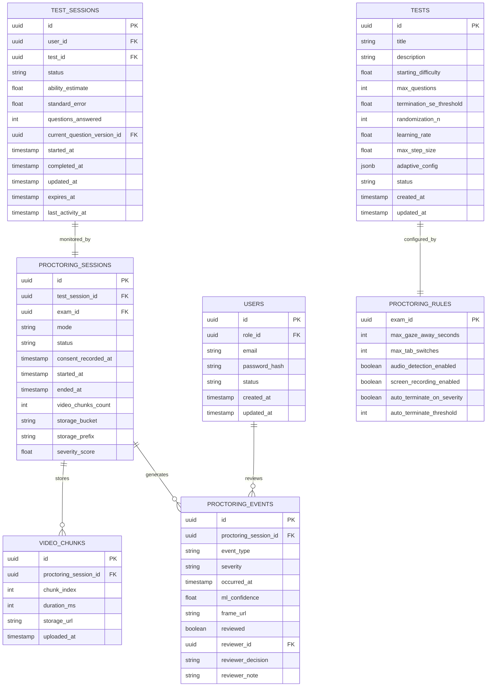


---

### ProctoringSession

Represents a single proctoring lifecycle attached to a learner's active test session.


| Field               | Type              | Description                            |
| ------------------- | ----------------- | -------------------------------------- |
| id                  | UUID (PK)         | Unique identifier                      |
| test_session_id     | UUID (FK, UNIQUE) | Linked test session                    |
| exam_id             | UUID (FK)         | Linked exam                            |
| mode                | ENUM              | automated, live, record_review         |
| status              | ENUM              | pending, active, completed, terminated |
| consent_recorded_at | TIMESTAMPTZ       | Learner consent timestamp              |
| started_at          | TIMESTAMPTZ       | Session start time                     |
| ended_at            | TIMESTAMPTZ       | Session end time                       |
| video_chunks_count  | INT               | Number of stored video chunks          |
| storage_bucket      | TEXT              | Object storage bucket                  |
| storage_prefix      | TEXT              | Storage path prefix                    |
| severity_score      | FLOAT             | Aggregated post-session risk score     |


Relationship:

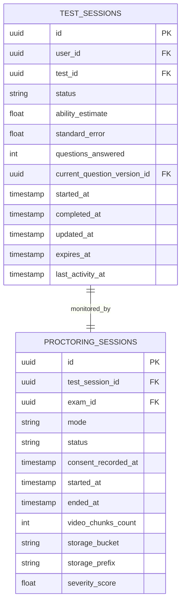


Indexes:

```sql
CREATE UNIQUE INDEX idx_proctoring_session_test_session
ON proctoring_sessions(test_session_id);

CREATE INDEX idx_proctoring_sessions_review_queue
ON proctoring_sessions(status, severity_score DESC);
```

---

### VideoChunk

Represents a stored video segment uploaded during a proctoring session.


| Field                 | Type        | Description               |
| --------------------- | ----------- | ------------------------- |
| id                    | UUID (PK)   | Unique identifier         |
| proctoring_session_id | UUID (FK)   | Parent proctoring session |
| chunk_index           | INT         | Sequence number           |
| duration_ms           | INT         | Duration in milliseconds  |
| storage_url           | TEXT        | Object storage location   |
| uploaded_at           | TIMESTAMPTZ | Upload timestamp          |


Relationship:

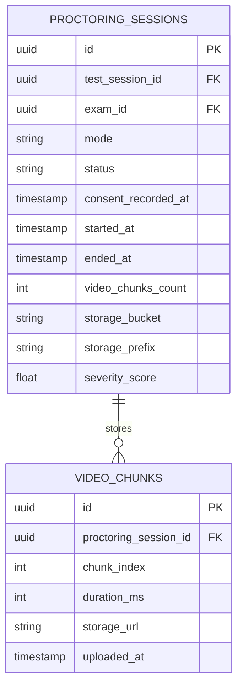


Indexes:

```sql
CREATE INDEX idx_video_chunks_session_chunk
ON video_chunks(proctoring_session_id, chunk_index);
```

This index enables efficient retrieval of chunks in chronological order during playback.

---

### ProctoringEvent

Represents an ML-generated or client-generated integrity event.

Examples:

- no_face
- multiple_faces
- gaze_away
- tab_switch
- audio_anomaly
- object_detected
- heartbeat_missed
- screen_share_stopped


| Field                 | Type              | Description          |
| --------------------- | ----------------- | -------------------- |
| id                    | UUID (PK)         | Unique identifier    |
| proctoring_session_id | UUID (FK)         | Parent session       |
| event_type            | ENUM              | Event category       |
| severity              | ENUM              | low, medium, high    |
| occurred_at           | TIMESTAMPTZ       | Event timestamp      |
| ml_confidence         | FLOAT             | ML confidence score  |
| frame_url             | TEXT              | Snapshot URL         |
| reviewed              | BOOLEAN           | Reviewer processed   |
| reviewer_id           | UUID (FK → Users) | Reviewer             |
| reviewer_decision     | ENUM              | confirmed, dismissed |
| reviewer_note         | TEXT              | Review notes         |


Relationships:

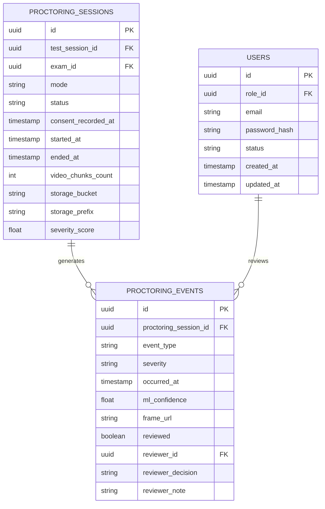


Indexes:

```sql
CREATE INDEX idx_proctoring_events_session_time
ON proctoring_events(proctoring_session_id, occurred_at);

CREATE INDEX idx_proctoring_events_review_queue
ON proctoring_events(reviewed, severity, occurred_at DESC);
```

These indexes support reviewer workflows and event timeline playback.

---

### ProctoringRule

Defines exam-specific integrity policies and detection thresholds.


| Field                      | Type          | Description                   |
| -------------------------- | ------------- | ----------------------------- |
| exam_id                    | UUID (PK, FK) | Linked exam                   |
| max_gaze_away_seconds      | INT           | Allowed gaze deviation        |
| max_tab_switches           | INT           | Allowed tab switches          |
| audio_detection_enabled    | BOOLEAN       | Enable audio analysis         |
| screen_recording_enabled   | BOOLEAN       | Require screen recording      |
| auto_terminate_on_severity | BOOLEAN       | Automatic termination enabled |
| auto_terminate_threshold   | INT           | High severity threshold       |


Relationship:

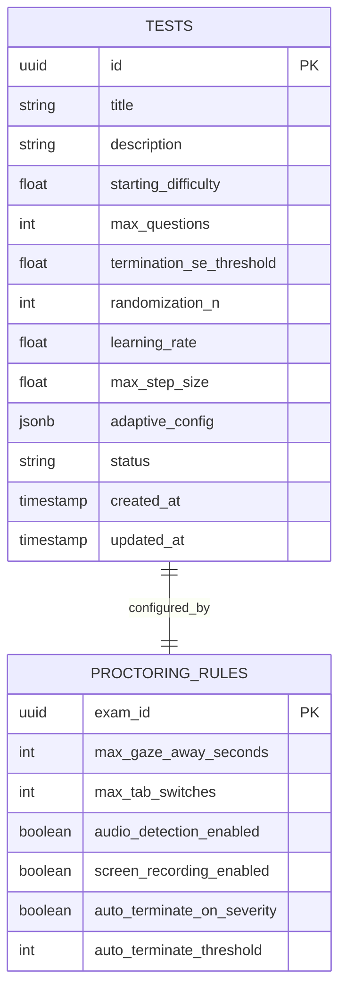


Each exam can define its own monitoring policy without affecting the adaptive testing engine.

---

### Design Notes

The proctoring subsystem is modeled as a separate domain attached to the LMS through `TestSession`.

When a learner starts a proctored exam:

1. A `ProctoringSession` is created.
2. The browser establishes a WebRTC connection to the SFU cluster.
3. Video streams are stored as `VideoChunk` records.
4. ML detections generate `ProctoringEvent` records.
5. Human reviewers can review and classify events.
6. Exam-specific behavior is controlled through `ProctoringRule`.

This separation allows the proctoring infrastructure to scale independently of the adaptive testing engine while preserving strong relational integrity between testing and monitoring data.

```

```

<a id="3-adaptive-algorithm-design"></a>

# 3. Adaptive Algorithm Design

<a id="a-approach-selection"></a>

## a. Approach Selection

The adaptive testing engine uses **Item Response Theory (IRT)** with a **1-Parameter Logistic (1PL) Rasch Model** to estimate learner ability in real time.

The Rasch model was selected because:

- It is widely used in large-scale adaptive assessments.
- It provides statistically grounded ability estimation.
- It supports confidence-based early termination.
- Question selection naturally adapts to the learner's estimated ability.
- It is simpler to calibrate and maintain than more advanced IRT variants (2PL and 3PL).

Unlike a naive difficulty walk (e.g., correct answer = difficulty +1, incorrect answer = difficulty -1), IRT models the probability of a correct answer as a function of both learner ability and question difficulty.

---

<a id="b-core-concepts"></a>

## b. Core Concepts

### Learner Ability (θ)

Each learner is represented by a latent ability parameter:

```text
θ (theta)
```

Examples:


| Ability Level | θ   |
| ------------- | --- |
| Beginner      | -2  |
| Average       | 0   |
| Advanced      | +2  |
| Expert        | +4  |


The true ability is unknown and is estimated continuously throughout the test.

---

### Question Difficulty (b)

Each question is assigned a difficulty parameter:

```text
b
```

Examples:


| Question Difficulty | b   |
| ------------------- | --- |
| Very Easy           | -2  |
| Easy                | -1  |
| Medium              | 0   |
| Hard                | +1  |
| Very Hard           | +2  |


---

### Rasch Probability Model

The probability that a learner answers a question correctly is:

```math
P(correct) = \frac{1}{1 + e^{-(\theta - b)}}
```

Where:

- θ = learner ability
- b = question difficulty

#### Interpretation


| θ   | b   | Probability Correct |
| --- | --- | ------------------- |
| 0   | 0   | 50%                 |
| 2   | 0   | 88%                 |
| 0   | 2   | 12%                 |


As learner ability increases relative to question difficulty, the probability of answering correctly increases.

---

### Ability Estimation

The system initializes every learner with a configurable starting ability estimate.

Example:

```text
θ = 0
```

After each answer, the ability estimate is updated using Maximum Likelihood Estimation (MLE).

The objective is to find the ability value that best explains the learner's observed responses.

Likelihood function:

```math
L(\theta)=\prod P_i^{u_i}(1-P_i)^{(1-u_i)}
```

Where:

- u = 1 for correct answers
- u = 0 for incorrect answers

For numerical stability, the implementation uses log-likelihood:

```math
\log L(\theta)=\sum [u_i\log(P_i)+(1-u_i)\log(1-P_i)]
```

Ability estimation is recalculated after every submitted answer.

---

### Ability Update Process

For each answered question:

1. Calculate probability of success using the Rasch model.
2. Compare predicted outcome with actual outcome.
3. Update learner ability estimate.
4. Recalculate confidence metrics.
5. Select the next question.

The estimate gradually converges toward the learner's true ability.

Example:

```text
Initial θ = 0.0

Correct
→ θ = 0.6

Correct
→ θ = 1.1

Correct
→ θ = 1.6

Incorrect
→ θ = 1.4

Correct
→ θ = 1.7
```

Over time the changes become smaller as confidence increases.

---

### Damped Ability Update

A pure Newton-Raphson update can move the learner's ability estimate too aggressively after a single answer.

For example, if the learner starts at:

```text
θ = 0
```

and answers a medium question correctly:

```text
b = 0
```

then:

```text
P(correct) = 0.5
```

and:

```text
I = P × (1 - P)
I = 0.5 × 0.5
I = 0.25
```

The raw update is:

```text
raw_update = (u - P) / I
raw_update = (1 - 0.5) / 0.25
raw_update = 2
```

Without damping:

```text
θ_new = 0 + 2
θ_new = 2
```

This is too large after only one answer.

To avoid overreacting to single responses, the system applies a configurable damping factor:

```text
θ_new = θ_old + α × ((u - P) / I)
```

Where:

- α = damping factor
- u = actual answer outcome
- P = predicted probability of correct answer
- I = item information

For this system:

```text
α = 0.3
```

So the same update becomes:

```text
θ_new = 0 + 0.3 × 2
θ_new = 0.6
```

This produces a more stable ability estimate.

---

### Step Clamping

Even with damping, extreme cases can still create large movements.

Therefore, the update step is clamped:

```text
step = clamp(α × raw_update, -0.75, +0.75)
```

Then:

```text
θ_new = θ_old + step
```

This prevents one answer from increasing or decreasing ability by more than `0.75`.

---

### Ability Bounds

The final ability estimate is also bounded within the calibrated ability range:

```text
θ_new = clamp(θ_old + step, -4, +4)
```

This prevents impossible values such as:

```text
θ = +infinity
```

or:

```text
θ = -infinity
```

---

### Production-Safe Update Formula

The production-safe update flow is:

```text
P = 1 / (1 + e^(-(θ - b)))

I = P × (1 - P)

raw_update = (u - P) / max(I, 0.05)

step = clamp(0.3 × raw_update, -0.75, +0.75)

θ_new = clamp(θ_old + step, -4, +4)
```

This gives the adaptive engine three layers of safety:

1. Damping factor
2. Maximum step size
3. Minimum and maximum ability bounds

This makes the algorithm stable even when learners guess correctly, misclick, or produce unusual answer patterns.

---

### Item Information

Not all questions contribute equally to ability estimation.

The information provided by a question is:

```math
I_i(\theta)=P_i(1-P_i)
```

A question provides maximum information when:

```text
θ ≈ b
```

Meaning:

- Extremely easy questions provide little information.
- Extremely difficult questions provide little information.
- Questions near the learner's estimated ability provide the most information.

---

### Question Selection Strategy

The adaptive engine uses **Maximum Information Item Selection**.

The next question is selected by finding the available question whose difficulty is closest to the learner's current ability estimate.

```math
Question = argmin |θ - b_i|
```

Additional constraints:

- Questions already answered are excluded.
- Question pools are balanced by topic.
- Exposure limits prevent excessive reuse of the same questions.

This ensures that every new question contributes meaningful information toward ability estimation.

---

### Confidence Estimation

Ability estimates alone are insufficient.

The system must also estimate how confident it is in the current ability estimate.

---

### Test Information

Total information accumulated during the test:

```math
I_{total}(\theta)=\sum I_i(\theta)
```

---

### Standard Error

Confidence is represented using Standard Error (SE):

```math
SE(\theta)=\frac{1}{\sqrt{I_{total}(\theta)}}
```

Interpretation:


| Standard Error | Confidence      |
| -------------- | --------------- |
| High SE        | Low confidence  |
| Low SE         | High confidence |


As more informative questions are answered:

```text
Information ↑

Standard Error ↓

Confidence ↑
```

---

### Confidence Interval

A 95% confidence interval can be calculated as:

```math
CI = θ ± 1.96 × SE
```

Example:

```text
Ability = 2.3
SE = 0.2
```

Confidence interval:

```text
2.3 ± 0.392
```

Result:

```text
[1.91, 2.69]
```

Meaning the learner's true ability is likely within that range.

---

<a id="c-test-termination"></a>

## c. Test Termination

The test may terminate early if sufficient confidence has been achieved.

Termination occurs when either:

### Condition 1

Maximum question count reached.

```text
questions_answered >= max_questions
```

### Condition 2

Confidence threshold reached.

```text
SE < 0.20
```

Example:

```text
Max Questions = 40

Current Ability = 2.1
Current SE = 0.18
```

The test may end after 18 questions because the estimate is already sufficiently precise.

---

<a id="d-edge-cases"></a>

## d. Edge Cases

### All Answers Correct

If a learner answers every question correctly:

- Ability estimate (θ) increases after each response.
- The adaptive engine selects progressively harder questions.
- Ability updates are damped using the configured `learning_rate`.
- Individual updates are limited by `max_step_size`.
- Ability is bounded within configured limits (e.g. `-4 ≤ θ ≤ +4`).
- The estimate never becomes infinite.
- Standard Error (SE) continues decreasing as more evidence is collected.
- The test may terminate early if the configured SE threshold is reached before `max_questions`.

Example:

```text
θ = 3.95
raw update = +1.8

max_step_size = 0.75

θ_new = min(3.95 + 0.75, 4.0)

= 4.0
```

---

### All Answers Incorrect

If a learner answers every question incorrectly:

- Ability estimate decreases after each response.
- Easier questions are selected.
- Ability updates remain damped.
- Update size is capped using `max_step_size`.
- A lower ability bound prevents negative infinity.
- The estimate converges toward the configured minimum ability.

Example:

```text
θ = -3.8
raw update = -1.4

max_step_size = 0.75

θ_new = max(-3.8 - 0.75, -4.0)

= -4.0
```

---

### Very Few Questions Remaining

When nearing the maximum question count:

- The system continues selecting the highest-information unanswered questions available.
- Exposure limits are still respected.
- Confidence thresholds become secondary to completion requirements.
- The assessment ends when `max_questions` is reached, even if the target SE has not been achieved.

This prevents infinite test sessions when the question pool is exhausted or confidence improves slowly.

---

### No Eligible Questions Remaining

A learner may exhaust the available question pool because of:

- Exposure limits
- Topic constraints
- Previously answered questions
- Small question banks

Fallback behavior:

```text
1. Expand difficulty search window.
2. Search neighboring difficulty bands.
3. Use lower-information questions if necessary.
4. End assessment if no valid question remains.
```

The system never repeats a previously answered question.

---

### Learner Disconnects Mid-Test

If the learner closes the browser, refreshes the page, or temporarily loses connectivity:

- The active `TestSession` remains server-side.
- Previously submitted answers remain immutable.
- The learner resumes from the current unanswered question.
- Ability estimate and SE are preserved.
- Disconnect and resume actions are recorded in `AuditLog`.

Resume is allowed only while:

```text
session.status = active
```

and:

```text
now < session.expires_at
```

---

### Duplicate Submission / Network Retry

A learner's browser may retry a request because of a timeout.

Protection:

- `idempotency_key`
- Session row locking
- Unique answer constraint

If the same request is retried:

```text
Original response is returned.
```

If the learner attempts to modify the payload:

```text
Replay attempt is rejected and audited.
```

---

<a id="e-known-failure-modes"></a>

## e. Known Failure Modes

### Poor Question Calibration

If question difficulty values are inaccurate:

- Ability estimates become unreliable.
- Standard Error becomes misleading.
- Adaptive question selection degrades.

Mitigation:

- Periodic recalibration.
- Difficulty re-estimation from historical responses.
- Item-analysis dashboards.
- Statistical monitoring of drift.
- Retirement of poorly performing items.

---

### Question Leakage

If learners share screenshots or answers externally:

- Question difficulty assumptions become invalid.
- Exposure increases unevenly.
- Ability estimates become biased.

Mitigation:

- Large question banks.
- Adaptive selection with low overlap.
- Exposure limits (`max_exposure`).
- Dynamic watermarking.
- Question versioning.
- Leak detection analytics.
- Question retirement workflows.

---

### Lucky Guessing

Multiple-choice questions allow random guessing.

Example:

```text
4-option MCQ

Random success probability = 25%
```

Mitigation:

- Large item pools.
- Confidence monitoring using SE.
- Difficult follow-up questions after correct answers.
- Exposure controls.
- Future migration to 3PL IRT if guessing becomes a significant issue.

---

### Question Bank Exhaustion

If:

- The question bank is too small,
- Exposure limits are too aggressive,
- Or many concurrent learners take the same test,

the adaptive engine may run out of high-quality candidates.

Mitigation:

- Larger calibrated pools.
- Topic-balanced item banks.
- Top-N randomization.
- Dynamic exposure limits.
- Automated alerts when question utilization becomes too high.

---

### Ability Oscillation

A learner alternating between correct and incorrect answers may cause ability estimates to oscillate.

Example:

```text
Correct
Incorrect
Correct
Incorrect
```

Mitigation:

- Learning-rate damping.
- Maximum step-size limits.
- Confidence-based convergence.
- Larger calibrated question pools.

These controls prevent extreme jumps caused by single responses.

---

### Proctoring False Positives

Computer vision systems may incorrectly flag legitimate learner behavior.

Examples:

- Looking away briefly.
- Poor lighting.
- Temporary camera obstruction.
- Background noise.

Mitigation:

- Severity scoring.
- Multiple signals before escalation.
- Human reviewer verification.
- Manual override workflow.
- No automatic accusation based on a single event.

The system treats ML detections as evidence, not final decisions.

---

<a id="f-advantages-of-the-rasch-model"></a>

## f. Advantages of the Rasch Model

### Benefits

- Statistically rigorous
- Easy to explain and audit
- Supports confidence estimation
- Enables adaptive question selection
- Supports early termination
- Industry-proven approach

### Limitations

- Assumes all questions have equal discrimination power
- Does not explicitly model guessing
- Requires periodic calibration of question difficulties

Despite these limitations, the Rasch model provides an excellent balance between implementation complexity, interpretability, and assessment quality for a large-scale adaptive LMS.

```

```

<a id="4-api-design"></a>

# 4. API Design

<a id="a-api-style"></a>

## a. API Style

The system exposes a REST API over HTTPS.

REST was selected over GraphQL because the LMS workflows are highly transactional and follow well-defined request/response patterns such as starting a test, submitting an answer, resuming a session, and managing proctoring events.

The primary system requirement is correctness, consistency, and predictable performance under 50,000+ concurrent learners rather than flexible client-driven data retrieval.

Benefits of REST for this use case include:

- Simpler implementation and operational complexity.
- Easier API versioning and OpenAPI documentation.
- Better support for API Gateway features such as rate limiting, caching, monitoring, and request validation.
- Clear separation of commands (e.g., submit answer, start test) and resources.
- Reduced risk of expensive client-generated queries that could impact system performance during peak exam windows.

GraphQL would be beneficial if clients required highly flexible querying across deeply nested resources. However, the LMS primarily consists of predefined workflows with predictable payloads, making REST the simpler and more operationally efficient choice.

All endpoints are versioned under:

```text
/api/v1
```

Authentication uses a Bearer JWT access token:

```http
Authorization: Bearer <access_token>
```

---

### OpenAPI Sketch

```yaml
openapi: 3.0.3
info:
  title: Adaptive LMS API
  version: 1.0.0

servers:
  - url: https://api.example.com/api/v1

security:
  - bearerAuth: []

paths:
  /auth/login:
    post:
      summary: Login and receive access token. 5 requests/minute per IP
      tags: [Auth]
      security: []
      requestBody:
        required: true
        content:
          application/json:
            schema:
              type: object
              required: [email, password]
              properties:
                email:
                  type: string
                  example: learner@example.com
                password:
                  type: string
                  format: password
      responses:
        "200":
          description: Login successful
          content:
            application/json:
              schema:
                type: object
                properties:
                  access_token:
                    type: string
                  refresh_token:
                    type: string
                  expires_in:
                    type: integer
                    example: 900

  /auth/refresh:
    post:
      summary: Refresh access token
      tags: [Auth]
      security: []
      requestBody:
        required: true
        content:
          application/json:
            schema:
              type: object
              required: [refresh_token]
              properties:
                refresh_token:
                  type: string
      responses:
        "200":
          description: New access token issued
          content:
            application/json:
              schema:
                type: object
                properties:
                  access_token:
                    type: string
                  expires_in:
                    type: integer
                    example: 900

  /tests/{test_id}/sessions:
    post:
      summary: Start a new adaptive test session
      tags: [Tests]
      parameters:
        - name: test_id
          in: path
          required: true
          schema:
            type: string
            format: uuid
      responses:
        "201":
          description: Test session started
          content:
            application/json:
              schema:
                type: object
                properties:
                  test_session_id:
                    type: string
                    format: uuid
                  status:
                    type: string
                    example: active
                  ability_estimate:
                    type: number
                    example: 0
                  standard_error:
                    type: number
                    example: 2.0
                  question:
                    $ref: "#/components/schemas/QuestionForLearner"

  /test-sessions/{session_id}:
    get:
      summary: Resume or fetch current test session state
      tags: [TestSessions]
      parameters:
        - name: session_id
          in: path
          required: true
          schema:
            type: string
            format: uuid
      responses:
        "200":
          description: Current session state
          content:
            application/json:
              schema:
                type: object
                properties:
                  test_session_id:
                    type: string
                    format: uuid
                  status:
                    type: string
                    example: active
                  questions_answered:
                    type: integer
                    example: 4
                  max_questions:
                    type: integer
                    example: 40
                  ability_estimate:
                    type: number
                    example: 1.2
                  standard_error:
                    type: number
                    example: 0.71
                  current_question:
                    $ref: "#/components/schemas/QuestionForLearner"
                  expires_at:
                    type: date
                    example: "2026-05-29T11:30:00Z"
                  last_activity_at:
                    type: date
                    example: "2026-05-29T10:25:00Z"

  /test-sessions/{session_id}/answers:
    post:
      summary: Submit answer and receive next question
      tags: [Answers]
      parameters:
        - name: session_id
          in: path
          required: true
          schema:
            type: string
            format: uuid
      requestBody:
        required: true
        content:
          application/json:
            schema:
              type: object
              required: [question_version_id, selected_option, client_answered_at]
              properties:
                question_version_id:
                  type: string
                  format: uuid
                selected_option:
                  type: string
                  example: "B"
                client_answered_at:
                  type: string
                  format: date-time
                idempotency_key:
                  type: string
                  description: Client-generated UUID to safely retry requests
      responses:
        "200":
          description: Answer accepted and next question returned
          content:
            application/json:
              schema:
                $ref: "#/components/schemas/SubmitAnswerResponse"
        "409":
          description: Duplicate or replayed answer rejected

  /test-sessions/{session_id}/complete:
    post:
      summary: Submit and complete a test session
      tags: [TestSessions]
      parameters:
        - name: session_id
          in: path
          required: true
          schema:
            type: string
            format: uuid
      responses:
        "200":
          description: Test completed
          content:
            application/json:
              schema:
                type: object
                properties:
                  test_session_id:
                    type: string
                    format: uuid
                  status:
                    type: string
                    example: completed
                  final_ability_estimate:
                    type: number
                    example: 1.74
                  standard_error:
                    type: number
                    example: 0.18

  /proctoring/sessions:
    post:
      summary: Start a proctoring session
      tags: [Proctoring]
      requestBody:
        required: true
        content:
          application/json:
            schema:
              type: object
              required: [test_session_id, consent]
              properties:
                test_session_id:
                  type: string
                  format: uuid
                consent:
                  type: boolean
                  example: true
      responses:
        "201":
          description: Proctoring session created
          content:
            application/json:
              schema:
                type: object
                properties:
                  proctoring_session_id:
                    type: string
                    format: uuid
                  sfu_url:
                    type: string
                  webrtc_token:
                    type: string
                  turn_credentials:
                    type: object

  /proctoring/sessions/{id}/heartbeat:
    post:
      summary: Send learner proctoring heartbeat
      tags: [Proctoring]
      parameters:
        - name: id
          in: path
          required: true
          schema:
            type: string
            format: uuid
      responses:
        "204":
          description: Heartbeat accepted

  /proctoring/sessions/{id}/events:
    get:
      summary: List proctoring events for review
      tags: [Proctoring]
      parameters:
        - name: id
          in: path
          required: true
          schema:
            type: string
            format: uuid
        - name: severity
          in: query
          schema:
            type: string
            enum: [low, medium, high]
      responses:
        "200":
          description: Proctoring events
          content:
            application/json:
              schema:
                type: object
                properties:
                  events:
                    type: array
                    items:
                      $ref: "#/components/schemas/ProctoringEvent"

components:
  securitySchemes:
    bearerAuth:
      type: http
      scheme: bearer
      bearerFormat: JWT

  schemas:
    QuestionForLearner:
      type: object
      properties:
        question_version_id:
          type: string
          format: uuid
        prompt:
          type: string
        options:
          type: array
          items:
            type: object
            properties:
              key:
                type: string
                example: "A"
              text:
                type: string
        difficulty:
          type: number
          description: Optional; may be hidden from learner in production

    SubmitAnswerResponse:
      type: object
      properties:
        answer_id:
          type: string
          format: uuid
        is_correct:
          type: boolean
          description: May be hidden until test completion depending on exam config
        ability:
          type: object
          properties:
            before:
              type: number
              example: 1.2
            after:
              type: number
              example: 1.46
            standard_error:
              type: number
              example: 0.62
            confidence_interval_95:
              type: object
              properties:
                lower:
                  type: number
                  example: 0.245
                upper:
                  type: number
                  example: 2.675
        adaptive_state:
          type: object
          properties:
            questions_answered:
              type: integer
              example: 8
            termination_se_threshold:
              type: number
              example: 0.20
            randomization_n:
              type: integer
              example: 20
        test_status:
          type: string
          enum: [active, completed]
        next_question:
          nullable: true
          allOf:
            - $ref: "#/components/schemas/QuestionForLearner"

    ProctoringEvent:
      type: object
      properties:
        id:
          type: string
          format: uuid
        event_type:
          type: string
          enum:
            - no_face
            - multiple_faces
            - phone_detected
            - book_detected
            - gaze_away
            - audio_anomaly
            - tab_switch
            - screen_share_stopped
            - heartbeat_missed
            - camera_stopped
            - microphone_stopped
            - virtual_camera_detected
            - stream_frozen
          example: gaze_away
        severity:
          type: string
          enum: [low, medium, high]
        occurred_at:
          type: string
          format: date-time
        ml_confidence:
          type: number
          example: 0.92
        reviewed:
          type: boolean
```

This gives you more than 8 endpoints, but the most important 8 are clearly covered: login, refresh, start test, resume session, submit answer, complete session, start proctoring, heartbeat, and list proctoring events.

---

<a id="b-submit-answer-get-next-question"></a>

## b. Submit Answer → Get Next Question

The endpoint accepts the learner's answer, validates that the question belongs to the active session, prevents duplicate submissions, updates the learner's ability estimate, and returns the next adaptive question.

### Endpoint

```http
POST /api/v1/test-sessions/{session_id}/answers
Authorization: Bearer <access_token>
Content-Type: application/json
```

---

### Request Shape

```json
{
  "question_version_id": "7f8e6d3c-2a1b-4c9d-9f10-123456789abc",
  "selected_option": "B",
  "client_answered_at": "2026-05-29T10:15:30.000Z",
  "idempotency_key": "b3d1c7c2-22ef-4e33-a5f2-88c83f25a991"
}
```

### Request Fields


| Field               | Type         | Required | Description                                           |
| ------------------- | ------------ | -------- | ----------------------------------------------------- |
| question_version_id | UUID         | Yes      | Exact question version shown to the learner           |
| selected_option     | string       | Yes      | Learner's selected answer option                      |
| client_answered_at  | ISO datetime | Yes      | Client-side answer timestamp                          |
| idempotency_key     | UUID         | Yes      | Client-generated key used to safely retry the request |


---

### Successful Response: Next Question Returned

```json
{
  "answer_id": "88f3a4e9-7b3d-41d2-9556-67abda742012",
  "accepted": true,
  "is_correct": true,
  "ability": {
    "before": 1.2,
    "after": 1.46,
    "standard_error": 0.62,
    "confidence_interval_95": {
      "lower": 0.245,
      "upper": 2.675
    }
  },
  "progress": {
    "questions_answered": 8,
    "max_questions": 40,
    "remaining_questions": 32
  },
  "test_status": "active",
  "next_question": {
    "question_version_id": "94b2d735-72d1-4cb7-9120-9c5409fb1c33",
    "prompt": "Which data structure is most suitable for implementing an LRU cache?",
    "options": [
      {
        "key": "A",
        "text": "Array only"
      },
      {
        "key": "B",
        "text": "Stack only"
      },
      {
        "key": "C",
        "text": "Hash map with doubly linked list"
      },
      {
        "key": "D",
        "text": "Queue only"
      }
    ]
  }
}
```

---

### Successful Response: Test Completed

If the system reaches the maximum question count or the confidence threshold, no next question is returned.

```json
{
  "answer_id": "88f3a4e9-7b3d-41d2-9556-67abda742012",
  "accepted": true,
  "is_correct": false,
  "ability": {
    "before": 1.46,
    "after": 1.38,
    "standard_error": 0.18,
    "confidence_interval_95": {
      "lower": 1.027,
      "upper": 1.733
    }
  },
  "progress": {
    "questions_answered": 22,
    "max_questions": 40,
    "remaining_questions": 18
  },
  "test_status": "completed",
  "completion_reason": "confidence_threshold_reached",
  "next_question": null
}
```

Allowed values for `completion_reason` are:
* confidence_threshold_reached
* max_questions_reached
* question_pool_exhausted
* terminated_by_admin
* terminated_by_proctor

---

### Duplicate or Replay Response

If the learner resubmits an already answered question, the system rejects it.

```http
409 Conflict
```

```json
{
  "error": {
    "code": "ANSWER_ALREADY_SUBMITTED",
    "message": "This question has already been answered for this test session."
  }
}
```

```http
409 Conflict
```

```json
{
  "error": {
    "code": "REPLAY_ATTACK_DETECTED",
    "message": "The request payload does not match the original idempotent submission."
  }
}
```

---

### Invalid Current Question Response

If the submitted question does not match the current active question for the session, the request is rejected.

```http
409 Conflict
```

```json
{
  "error": {
    "code": "QUESTION_NOT_ACTIVE",
    "message": "The submitted question is not the active question for this session."
  }
}
```

---

### Unauthorized Response

```http
401 Unauthorized
```

```json
{
  "error": {
    "code": "UNAUTHORIZED",
    "message": "A valid access token is required."
  }
}
```

---

### Server-Side Processing Flow

1. Validate JWT and confirm learner owns the test session.
2. Start a database transaction.
3. Lock the `TestSession` row using `SELECT ... FOR UPDATE`.
4. Verify the session is active.
5. Verify `question_version_id` matches the session's current question.
6. Check the answer does not already exist.
7. Insert the answer.
8. Update ability estimate and standard error.
9. Select the next adaptive question.
10. Update the session state.
11. Commit the transaction.
12. Return the next question or completed status.

The transaction and row lock ensure that two concurrent submissions for the same session cannot corrupt the session state.

---

<a id="c-authentication-and-authorization-model"></a>

## c. Authentication and Authorization Model

The system uses a JWT-based authentication model with short-lived access tokens and rotating refresh tokens.

All external API requests are served over HTTPS.

---

### Token Types

The system uses two token types:


| Token         | Purpose                  | Lifetime   |
| ------------- | ------------------------ | ---------- |
| Access Token  | Authorizes API requests  | 15 minutes |
| Refresh Token | Issues new access tokens | 7 days     |


---

### Access Token

The access token is a signed JWT.

It is sent with API requests using the `Authorization` header:

```http
Authorization: Bearer <access_token>
```

Example JWT claims:

```json
{
  "sub": "user_123",
  "role": "learner",
  "institution_id": "inst_456",
  "session_id": "auth_session_789",
  "iat": 1770000000,
  "exp": 1770000900
}
```

The API Gateway validates:

- Token signature
- Expiration time
- Issuer
- Audience
- Required role or permission

---

### Refresh Strategy

Refresh tokens are opaque, random tokens stored server-side in a hashed form.

Refresh token behavior:

- Issued after successful login.
- Stored in an HttpOnly, Secure, SameSite cookie.
- Rotated on every refresh request.
- Previous refresh token is invalidated after use.
- Reuse of an already rotated refresh token is treated as a possible token theft event.
- Refresh token expiry is 7 days by default.
- Logout revokes the active refresh token.

Refresh endpoint:

```http
POST /api/v1/auth/refresh
```

Response:

```json
{
  "access_token": "new.jwt.access.token",
  "expires_in": 900
}
```

This strategy limits the damage of access-token leakage while still allowing learners to continue long test sessions without re-authenticating.

---

### Role-Based Access Control

The system uses role-based access control.

Primary roles:


| Role       | Permissions                                                                    |
| ---------- | ------------------------------------------------------------------------------ |
| Learner    | Start tests, submit answers, resume own sessions, start own proctoring session |
| Instructor | View assigned tests, view learner results, manage question pools if permitted  |
| Admin      | Manage users, roles, tests, questions, exam configuration                      |
| Reviewer   | View proctoring sessions, review events, confirm or dismiss violations         |
| Proctor    | Monitor live sessions, warn learners, terminate sessions if allowed            |


---

### Role Checks by Endpoint


| Endpoint                                    | Allowed Roles                            |
| ------------------------------------------- | ---------------------------------------- |
| `POST /auth/login`                          | Public                                   |
| `POST /auth/refresh`                        | Public with valid refresh token          |
| `POST /tests/{test_id}/sessions`            | Learner                                  |
| `GET /test-sessions/{session_id}`           | Learner owning session, Instructor/Admin |
| `POST /test-sessions/{session_id}/answers`  | Learner owning session                   |
| `POST /test-sessions/{session_id}/complete` | Learner owning session                   |
| `POST /proctoring/sessions`                 | Learner owning test session              |
| `POST /proctoring/sessions/{id}/heartbeat`  | Learner owning proctoring session        |
| `GET /proctoring/sessions/{id}/events`      | Reviewer, Proctor, Admin                 |
| `PATCH /proctoring/events/{id}`             | Reviewer, Admin                          |
| `DELETE /proctoring/sessions/{id}`          | Proctor, Admin                           |


---

### Ownership Checks

Role checks alone are not enough.

For learner endpoints, the system also enforces ownership checks.

Example:

A learner may call:

```http
GET /api/v1/test-sessions/{session_id}
```

only if:

```text
test_sessions.user_id = authenticated_user.id
```

Similarly, a learner may submit an answer only for their own active session.

---

### Session-Level Security During Tests

During an active test:

- The learner's JWT identity must match the `TestSession.user_id`.
- The submitted `question_version_id` must match the session's current question.
- The session must be in `active` status.
- Duplicate answers are rejected.
- Suspicious requests are written to `AuditLog`.

---

### Internal Service Authentication

Internal service-to-service APIs use mTLS.

Examples:

```http
POST /internal/proctoring/events
```

This endpoint is used by the ML Inference Service to submit detected proctoring events.

It is not exposed publicly and requires:

- mTLS client certificate
- Internal network access
- Service identity authorization

---

### Security Notes

- Passwords are hashed using Argon2id or bcrypt.
- All authentication traffic uses HTTPS.
- Access tokens are short-lived.
- Refresh tokens are rotated.
- Privileged actions are audited.
- Reviewer and admin access should require MFA in production.

---

<a id="d-proctoring-api-endpoints"></a>

## d. Proctoring API Endpoints

All proctoring endpoints are versioned under:

```http
/api/v1/proctoring
```

They require a valid JWT unless explicitly marked as internal.

Learner-facing endpoints require the authenticated learner to own the related `TestSession`. Reviewer and proctor endpoints require the `reviewer`, `proctor`, or `admin` role.

---

### 1. Start Proctoring Session

Creates a proctoring session for an active test session, records learner consent, allocates SFU resources, and returns WebRTC connection details.

```http
POST /api/v1/proctoring/sessions
Authorization: Bearer <access_token>
Content-Type: application/json
```

#### Request

```json
{
  "test_session_id": "0b2e1d6f-0217-4e3b-a4a9-22272e509b41",
  "consent": true
}
```

#### Response

```json
{
  "proctoring_session_id": "8f9248cf-8ecf-42f9-a47e-9d3393e7d933",
  "status": "pending",
  "mode": "automated",
  "sfu_url": "wss://sfu-us-east.example.com/webrtc",
  "webrtc_token": "short_lived_webrtc_token",
  "turn_credentials": {
    "urls": [
      "turn:turn-us-east.example.com:3478"
    ],
    "username": "temp-user",
    "credential": "temp-password",
    "expires_at": "2026-05-29T11:00:00Z"
  }
}
```

---

### 2. Get Proctoring Session Status

Returns proctoring session status, event summary, and severity score.

```http
GET /api/v1/proctoring/sessions/{id}
Authorization: Bearer <access_token>
```

#### Response

```json
{
  "proctoring_session_id": "8f9248cf-8ecf-42f9-a47e-9d3393e7d933",
  "test_session_id": "0b2e1d6f-0217-4e3b-a4a9-22272e509b41",
  "mode": "automated",
  "status": "active",
  "started_at": "2026-05-29T10:00:00Z",
  "ended_at": null,
  "severity_score": 2.4,
  "risk_level": "high",
  "event_summary": {
    "low": 3,
    "medium": 1,
    "high": 0
  }
}
```

---

### 3. Terminate Proctoring Session

Terminates a live proctoring session. This is restricted to proctors and admins.

```http
DELETE /api/v1/proctoring/sessions/{id}
Authorization: Bearer <access_token>
```

#### Response

```json
{
  "proctoring_session_id": "8f9248cf-8ecf-42f9-a47e-9d3393e7d933",
  "status": "terminated",
  "terminated_at": "2026-05-29T10:42:00Z"
}
```

---

### 4. Send Proctoring Heartbeat

The learner client sends this heartbeat every 30 seconds while the test is active.

Three missed heartbeats trigger a `heartbeat_missed` proctoring event.

```http
POST /api/v1/proctoring/sessions/{id}/heartbeat
Authorization: Bearer <access_token>
Content-Type: application/json
6 requests/minute per learner
```

#### Request

```json
{
  "client_timestamp": "2026-05-29T10:15:30Z",
  "webcam_active": true,
  "microphone_active": true,
  "screen_share_active": true,
  "visibility_state": "visible"
}
```

#### Response

```http
204 No Content
```

---

### 5. List Proctoring Events

Returns paginated proctoring events for a session. This endpoint is restricted to reviewers, proctors, and admins.

```http
GET /api/v1/proctoring/sessions/{id}/events?severity=high&reviewed=false&page=1&page_size=50
Authorization: Bearer <access_token>
```

#### Response

```json
{
  "proctoring_session_id": "8f9248cf-8ecf-42f9-a47e-9d3393e7d933",
  "page": 1,
  "page_size": 50,
  "total": 2,
  "events": [
    {
      "id": "e1b88c8f-6e43-43b1-a029-8e17fbdb2c91",
      "event_type": "multiple_faces",
      "severity": "high",
      "occurred_at": "2026-05-29T10:19:40Z",
      "ml_confidence": 0.94,
      "frame_url": "https://signed-url.example.com/frame.jpg",
      "reviewed": false
    }
  ]
}
```

---

### 6. Review Proctoring Event

Allows a reviewer to confirm or dismiss a generated event.

```http
PATCH /api/v1/proctoring/events/{id}
Authorization: Bearer <access_token>
Content-Type: application/json
``` 

#### Request

```json
{
  "decision": "confirmed",
  "note": "A second person was visible in the frame for several seconds."
}
```

#### Response

```json
{
  "event_id": "e1b88c8f-6e43-43b1-a029-8e17fbdb2c91",
  "reviewed": true,
  "reviewer_decision": "confirmed",
  "reviewed_at": "2026-05-29T11:05:00Z"
}
```

---

### 7. Internal ML Event Ingestion

This endpoint is used by the ML Inference Service to submit detected proctoring events.

It is internal only and protected using mTLS. It is not exposed through the public API Gateway.

```http
POST /internal/proctoring/events
mTLS required
Content-Type: application/json
```

#### Request

```json
{
  "proctoring_session_id": "8f9248cf-8ecf-42f9-a47e-9d3393e7d933",
  "event_type": "gaze_away",
  "severity": "medium",
  "occurred_at": "2026-05-29T10:23:10Z",
  "ml_confidence": 0.89,
  "frame_url": "s3://proctoring-bucket/session/frame-000123.jpg",
  "metadata": {
    "gaze_away_seconds": 12,
    "model_version": "gaze-v3.2"
  }
}
```

#### Response

```json
{
  "event_id": "5071f938-3534-4a61-97d6-b6c0f1ab753e",
  "accepted": true
}
```

---

<a id="e-access-control-summary"></a>

## e. Access Control Summary


| Endpoint                                   | Allowed Roles                                    |
| ------------------------------------------ | ------------------------------------------------ |
| `POST /proctoring/sessions`                | Learner owning test session                      |
| `GET /proctoring/sessions/{id}`            | Learner owning session, Reviewer, Proctor, Admin |
| `DELETE /proctoring/sessions/{id}`         | Proctor, Admin                                   |
| `POST /proctoring/sessions/{id}/heartbeat` | Learner owning session                           |
| `GET /proctoring/sessions/{id}/events`     | Reviewer, Proctor, Admin                         |
| `PATCH /proctoring/events/{id}`            | Reviewer, Admin                                  |
| `POST /internal/proctoring/events`         | Internal ML service only, mTLS                   |


The proctoring API is intentionally separated from the core test API so that video streaming, ML detection, and reviewer workflows can scale independently of answer submission and adaptive question selection.

```

```

<a id="5-concurrency-integrity-security"></a>

# 5. Concurrency, Integrity & Security

<a id="a-preventing-corruption-from-concurrent-requests"></a>

## a. Preventing Corruption from Concurrent Requests

The most sensitive concurrent flow is:

```text
submit answer → update ability → select next question
```

Two requests may hit the same `TestSession` at the same time if:

- The learner double-clicks the submit button.
- The browser retries after a network timeout.
- A malicious client replays the request.
- Mobile or unstable networks send duplicate requests.

Without protection, both requests could insert answers, update ability twice, or assign two different next questions.

---

### Strategy

The system prevents corruption using:

1. Database transaction
2. Row-level lock on `TestSession`
3. Unique constraint on submitted answers
4. Current-question validation
5. Idempotency key

---

### Transaction + Row Lock

When an answer is submitted, the backend starts a database transaction and locks the session row:

```sql
BEGIN;

SELECT *
FROM test_sessions
WHERE id = $1
FOR UPDATE;
```

This guarantees that only one request can modify the session at a time.

If two requests arrive together:

```text
Request A locks the session.
Request B waits.
Request A completes and commits.
Request B resumes, sees updated state, and is rejected if stale.
```

---

### Current Question Validation

After locking the session, the system checks that the submitted question is still the active question:

```sql
SELECT current_question_version_id
FROM test_sessions
WHERE id = $1;
```

Then validate:

```text
submitted_question_version_id == current_question_version_id
```

If not, reject with:

```http
409 Conflict
```

This prevents an old question from being submitted after the session has already moved forward.

---

### Duplicate Answer Protection

The `answers` table has a unique constraint:

```sql
CREATE UNIQUE INDEX idx_answers_session_question
ON answers(test_session_id, question_version_id);
```

This guarantees that the same question cannot be answered twice in the same session.

Even if application-level validation fails, the database still protects integrity.

---

### Idempotency Key

The client sends an `idempotency_key` with every answer submission.

```json
{
  "question_version_id": "question-version-id",
  "selected_option": "B",
  "idempotency_key": "client-generated-uuid"
}
```

The server stores both:

- idempotency_key
- payload_hash

with the accepted answer record.

The payload hash is computed from the canonical request payload and allows the server to distinguish a safe retry from a modified replay attempt.

Recommended constraint:

```sql
CREATE UNIQUE INDEX idx_answers_session_idempotency
ON answers(test_session_id, idempotency_key);
```

If the same request is retried with the same idempotency key, the server returns the original response instead of processing the answer again.

---

### Safe Processing Flow

```text
1. Receive answer submission.
2. Validate learner owns the test session.
3. Begin database transaction.
4. Lock TestSession row using SELECT ... FOR UPDATE.
5. Verify session status is active.
6. Verify submitted question is the current active question.
7. Check idempotency key.
8. Insert answer.
9. Update ability estimate and standard error.
10. Select next question.
11. Update TestSession current_question_version_id.
12. Commit transaction.
```

---

### Failure Behavior

If a second concurrent request arrives after the first request has already advanced the session:

```http
409 Conflict
```

Response:

```json
{
  "error": {
    "code": "QUESTION_NOT_ACTIVE",
    "message": "The submitted question is no longer active for this test session."
  }
}
```

If the same request is safely retried with the same idempotency key:

```http
200 OK
```

The original accepted response is returned.

---

### Why This Works

This design ensures that session state changes are serialized.

Only one request at a time can:

- Submit the active answer
- Update ability
- Increment answered count
- Assign the next question

The database transaction guarantees atomicity, while the row lock prevents race conditions and the unique constraints protect against duplicate writes.

---

<a id="b-preventing-previously-submitted-answer-changes-via-replay"></a>

## b. Preventing Previously Submitted Answer Changes via Replay

A learner must not be able to change an answer after it has already been submitted.

A replay attempt may happen when:

- The learner resends an older HTTP request.
- The browser retries a stale request after timeout.
- A malicious client modifies `selected_option` and resubmits the same `question_version_id`.
- The learner tries to submit an answer for a question that is no longer active.

---

### Core Rule

Answers are immutable once accepted.

After an answer is submitted:

```text
The answer cannot be updated.
The answer cannot be deleted.
The same question cannot be answered again in the same session.
```

If a correction is ever required, it must be handled through an administrative audit workflow, not by modifying the original row.

---

### Database Constraint

The system enforces this with a unique constraint:

```sql
CREATE UNIQUE INDEX idx_answers_session_question
ON answers(test_session_id, question_version_id);
```

This guarantees that one `TestSession` can have only one answer for a specific `QuestionVersion`.

Even if a replay request bypasses application-level checks, the database rejects the duplicate insert.

---

### Current Question Validation

Before accepting an answer, the backend verifies that the submitted question is still the active question for the session.

```text
submitted_question_version_id == test_sessions.current_question_version_id
```

If the session has already moved to the next question, the request is rejected:

```http
409 Conflict
```

```json
{
  "error": {
    "code": "QUESTION_NOT_ACTIVE",
    "message": "The submitted question is no longer active for this session."
  }
}
```

---

### Insert-Only Answer Model

The `answers` table is append-only.

The API does not expose:

```http
PUT /answers/{id}
PATCH /answers/{id}
DELETE /answers/{id}
```

Only this operation exists:

```http
POST /test-sessions/{session_id}/answers
```

This ensures learners cannot update a previously submitted answer through the public API.

---

### Idempotency Handling

Every answer submission includes an `idempotency_key`.

```json
{
  "question_version_id": "7f8e6d3c-2a1b-4c9d-9f10-123456789abc",
  "selected_option": "B",
  "idempotency_key": "b3d1c7c2-22ef-4e33-a5f2-88c83f25a991"
}
```

The server stores the key with the answer.

```sql
CREATE UNIQUE INDEX idx_answers_session_idempotency
ON answers(test_session_id, idempotency_key);
```

If the exact same request is retried with the same idempotency key, the server returns the original response.

If the learner reuses the same key with a different answer payload, the request is rejected as suspicious.

---

### Payload Fingerprint

For stronger replay protection, the system stores a hash of the accepted answer payload.

Example:

```text
payload_hash = SHA256(session_id + question_version_id + selected_option + idempotency_key)
```

On retry:

- Same idempotency key + same payload hash → return original response.
- Same idempotency key + different payload hash → reject and audit.
- Different idempotency key + same question → reject because answer already exists.

---

### Audit Logging

Replay and answer-change attempts are written to `AuditLog`.

Example audit event:

```json
{
  "action": "ANSWER_REPLAY_REJECTED",
  "test_session_id": "session-id",
  "question_version_id": "question-version-id",
  "user_id": "user-id",
  "metadata": {
    "reason": "Question already answered",
    "ip_address": "203.0.113.10",
    "user_agent": "Chrome"
  }
}
```

---

### Server-Side Processing

```text
1. Validate JWT and learner ownership.
2. Begin transaction.
3. Lock TestSession row using SELECT ... FOR UPDATE.
4. Verify session status is active.
5. Verify submitted question is the current question.
6. Check whether answer already exists.
7. Check idempotency key and payload hash.
8. Insert answer as immutable record.
9. Advance session to the next question.
10. Commit transaction.
```

---

### Result

This design prevents answer modification because:

- Accepted answers are immutable.
- Duplicate answers are rejected by database constraints.
- Stale questions are rejected.
- Idempotency keys allow safe retries but prevent modified replays.
- Suspicious attempts are recorded in the audit log.

---

<a id="c-handling-browser-closure-and-resume-policy"></a>

## c. Handling Browser Closure and Resume Policy

If a learner closes the browser, loses network connectivity, refreshes the page, or the device sleeps during a test, the system should allow a controlled resume without compromising exam integrity.

---

### Session State Is Server-Side

The test state is stored on the server in `TestSessions`, not only in the browser.

The session stores:

- `status`
- `current_question_version_id`
- `ability_estimate`
- `standard_error`
- `questions_answered`
- `started_at`
- `last_activity_at`
- `expires_at`

Because the active question and adaptive state are server-side, closing the browser does not lose the test state.

---

### Resume Policy

A learner may resume an interrupted test only if:

```text
session.status = active
```

and:

```text
now < session.expires_at
```

and:

```text
learner_id = test_session.user_id
```

The learner resumes from the last unanswered active question.

Already submitted answers cannot be changed.

If the session was already completed:

```text
status = completed
```

the learner may view the final result but may not resume answer submission.

If:

```text
status = terminated
```

the learner may not continue unless explicitly re-opened through an administrative workflow. These matches the completion reasons:

```text
confidence_threshold_reached
max_questions_reached
terminated_by_admin
terminated_by_proctor
```

---

### Recommended Timeout Rules

```text
Short disconnect: 0–60 seconds
Resume silently.

Medium disconnect: 1–10 minutes
Allow resume and write AuditLog event.

Long disconnect: more than 10 minutes
Mark session as interrupted and require instructor/admin review.

Exam time expired
Auto-complete or terminate the session based on exam configuration.
```

---

### Resume Endpoint

```http
GET /api/v1/test-sessions/{session_id}
Authorization: Bearer <access_token>
```

Returns the current active session and current unanswered question.

If the session is resumable:

```json
{
  "test_session_id": "session-id",
  "status": "active",
  "questions_answered": 8,
  "max_questions": 40,
  "ability_estimate": 1.46,
  "standard_error": 0.62,
  "last_activity_at": "2026-05-29T10:22:00Z",
  "expires_at": "2026-05-29T11:30:00Z",
  "current_question": {
    "question_version_id": "question-version-id",
    "prompt": "Which data structure is most suitable for implementing an LRU cache?",
    "options": [
      { "key": "A", "text": "Array only" },
      { "key": "B", "text": "Stack only" },
      { "key": "C", "text": "Hash map with doubly linked list" },
      { "key": "D", "text": "Queue only" }
    ]
  }
}
```

---

### Proctoring Resume Policy

If video proctoring is enabled, the client attempts WebRTC reconnection for up to 60 seconds.

If reconnection succeeds:

- The test continues.
- A low-severity reconnect event is logged.

If the learner is offline for more than 60 seconds:

- A `heartbeat_missed` or `connection_lost` proctoring event is created.
- The gap is visible in the reviewer timeline.
- The learner may continue only if the main test resume policy allows it.

If offline time exceeds the configured threshold:

- The test session is marked `interrupted`.
- The proctoring session is marked `terminated` or `requires_review`.
- A reviewer or instructor must decide whether the attempt remains valid.

---

### Audit Logging

Every interruption and resume is written to `AuditLog`.

Example events:

```text
TEST_SESSION_DISCONNECTED
TEST_SESSION_RESUMED
PROCTORING_HEARTBEAT_MISSED
PROCTORING_RECONNECTED
TEST_SESSION_INTERRUPTED
```

Audit metadata includes:

- user ID
- test session ID
- timestamp
- IP address
- user agent
- disconnect duration
- proctoring status

---

### Security Constraints

On resume:

- The learner must re-authenticate if the access token expired.
- Refresh token rotation is used to issue a new access token.
- The learner can only resume their own session.
- Previously answered questions remain immutable.
- The current question must match the server-side session state.
- The test timer continues running unless the exam explicitly allows pause-on-disconnect.

---

### Question Pool Exhaustion

The adaptive engine may be unable to find a valid next question because:

- All nearby questions have reached max_exposure.
- The learner has already answered all suitable questions.
- Topic constraints eliminate remaining candidates.

Fallback strategy:

1. Expand the difficulty search window.
2. Search neighboring difficulty bands.
3. Use lower-information questions.
4. Complete the assessment with:

```text
completion_reason = question_pool_exhausted
```

---


### Final Policy

The test is resumable, but not rewindable.

A learner can continue from the current server-side state, but cannot:

- Restart the test
- Change submitted answers
- Request a different active question
- Extend the timer unless allowed by administrator policy

This balances learner reliability concerns with exam integrity.

---

<a id="d-top-5-security-threats-and-mitigations"></a>

## d. Top 5 Security Threats and Mitigations

### 1. Answer Replay or Answer Modification

A learner may try to resend an old answer request or modify the selected option after seeing the next question.

**Mitigations:**

- Make answers immutable after submission.
- Reject duplicate answers using a unique constraint on `(test_session_id, question_version_id)`.
- Validate that the submitted question matches `TestSession.current_question_version_id`.
- Use idempotency keys for safe retries.
- Store payload hashes to detect modified replay attempts.
- Log suspicious replay attempts in `AuditLog`.

---

### 2. Session Hijacking or Token Theft

An attacker may steal a learner's access token and submit answers or access test data.

**Mitigations:**

- Use short-lived JWT access tokens.
- Use rotating refresh tokens stored in secure, HttpOnly, SameSite cookies.
- Enforce HTTPS for all traffic.
- Validate token issuer, audience, expiry, and signature.
- Bind active test sessions to the authenticated learner.
- Re-authenticate or step-up verification for sensitive actions.
- Log unusual IP/device changes during active tests.

---

### 3. Question Bank Leakage

Learners may screenshot, copy, record, or share questions externally.

**Mitigations:**

- Use large question pools and randomization.
- Serve only one question at a time.
- Use exposure limits (max_exposure) and Top-N adaptive randomization
- Do not expose correct answers in learner-facing APIs during the test.
- Use question versioning and rotation.
- Apply dynamic watermarking with learner ID/session ID.
- Monitor abnormal exposure patterns.
- Retire or recalibrate leaked questions.
- Use proctoring signals such as tab switches, screen recording gaps, or object detection.

---

### 4. Authorization Bypass and Privilege Abuse

A learner may attempt to access another learner's session, reviewer data, proctoring events, or admin-only endpoints.

**Mitigations:**

- Enforce role-based access control.
- Enforce ownership checks on learner resources.
- Use separate permissions for learner, instructor, reviewer, proctor, and admin roles.
- Protect internal endpoints using mTLS.
- Require MFA for privileged roles in production.
- Record privileged actions in `AuditLog`.
- Use least-privilege access for services and users.

---

### 5. Injection, Data Tampering, and API Abuse

Attackers may attempt SQL injection, malformed payloads, brute force, or high-volume API abuse during exam windows.

**Mitigations:**

- Use parameterized SQL queries or a safe ORM.
- Validate request payloads with strict schemas.
- Apply API Gateway rate limits.
- Use WAF rules for common attack patterns.
- Limit request body size.
- Use database constraints for integrity-critical rules.
- Monitor anomaly metrics such as failed submissions, invalid session access, and repeated conflicts.
- Apply circuit breakers and backpressure to protect core test flows.

---

<a id="e-webcam-microphone-permission-abuse-and-video-stream-tampering"></a>

## e. Webcam, Microphone Permission Abuse and Video Stream Tampering

The proctoring subsystem introduces additional security risks because it depends on learner-controlled browser permissions, device hardware, and media streams.

Two important threat categories are:

1. Webcam/microphone permission abuse
2. Video or audio stream tampering

---

### 1. Webcam and Microphone Permission Abuse

A learner may attempt to bypass proctoring by:

- Denying webcam permission.
- Denying microphone permission.
- Disabling permissions after the test starts.
- Muting or blocking the microphone.
- Covering the camera.
- Using browser settings or extensions to interfere with capture.
- Stopping screen share when screen recording is required.

#### Mitigations

Before the test starts:

- Require explicit learner consent.
- Call `getUserMedia({ video: true, audio: true })` before allowing the test to begin.
- If screen recording is required, call `getDisplayMedia()`.
- Do not start the test until required permissions are granted.
- Store `consent_recorded_at` in `ProctoringSession`.

During the test:

- Send client heartbeat every 30 seconds.
- Include webcam, microphone, screen share, and page visibility status in the heartbeat.
- Detect stopped media tracks using browser MediaStream APIs.
- Generate proctoring events when required streams stop.
- Trigger `heartbeat_missed`, `screen_share_stopped`, or `media_permission_revoked` events.
- Show clear learner warnings before termination.

Example heartbeat payload:

```json
{
  "client_timestamp": "2026-05-29T10:15:30Z",
  "webcam_active": true,
  "microphone_active": true,
  "screen_share_active": true,
  "visibility_state": "visible"
}
```

If permission abuse is detected:

```text
1. Create ProctoringEvent.
2. Increase session severity score.
3. Notify live proctor if mode = live.
4. Continue, pause, or terminate based on ProctoringRule.
```

---

### 2. Video Stream Tampering

A learner may attempt to fake or manipulate the media stream by:

- Using a virtual webcam.
- Playing a prerecorded video.
- Injecting synthetic frames.
- Using deepfake software.
- Blocking the real camera feed.
- Routing audio through a virtual microphone.
- Replacing the browser stream using automation tools.
- Manipulating WebRTC signalling.

#### Mitigations

Client-side controls:

- Detect known virtual camera device labels where browser permissions allow it.
- Monitor MediaStream track lifecycle events.
- Detect sudden device changes during an active session.
- Require screen recording for high-stakes exams.
- Capture periodic client environment metadata.
- Disable test continuation if required tracks stop unexpectedly.

Server-side and ML controls:

- Send media through SFU rather than trusting client-uploaded video files.
- Require WebRTC DTLS-SRTP encrypted transport.
- Use short-lived WebRTC tokens.
- Validate WebRTC session identity against `ProctoringSession`.
- Run liveness and consistency checks in the ML Inference Service.
- Detect frozen frames, repeated frame patterns, unnatural motion, and audio/video mismatch.
- Detect multiple faces, no face, gaze away, phone/object presence, and background voices.
- Compare heartbeat events with SFU stream health.

Infrastructure controls:

- SFU accepts streams only for valid active proctoring sessions.
- TURN credentials are short-lived.
- Internal ML event ingestion uses mTLS.
- Raw video chunks are stored in object storage with immutable metadata.
- Reviewer playback uses pre-signed URLs with short TTL.
- Every reviewer access is logged in `AuditLog`.

---

#### Event Types

Additional proctoring event types include:

```text
media_permission_denied
media_permission_revoked
camera_stopped
microphone_stopped
screen_share_stopped
virtual_camera_detected
stream_frozen
stream_replaced
audio_video_mismatch
heartbeat_missed
```

---

#### Policy

The system does not automatically accuse the learner based on a single media issue.

Instead:

- Low-risk events are logged.
- Repeated or high-severity events increase the session severity score.
- Live mode alerts the proctor immediately.
- Automated mode queues the session for post-exam review.
- Auto-termination is used only if enabled by `ProctoringRule`.

This avoids false positives while still preserving academic integrity.

Severity is accumulated across proctoring events.

Example:

```text
tab_switch = 1
phone_detected = 4
multiple_faces = 5
severity_score = 10
```

```

```

<a id="6-scaling-to-50000-concurrent-learners"></a>

# 6. Scaling to 50,000 Concurrent Learners

<a id="a-50000-learners-starting-a-test-in-the-same-5-minute-window"></a>

## a. 50,000 Learners Starting a Test in the Same 5-Minute Window

### Assumptions

```text
Learners starting test: 50,000
Start window: 5 minutes = 300 seconds
Average start-test rate: 50,000 / 300 = ~167 requests/second
Peak burst multiplier: 3x
Planned peak start-test capacity: ~500 requests/second
```

The system is designed for the expected average rate of ~167 start requests/second, with enough headroom to absorb short bursts up to ~500 requests/second.

---

### High-Level Start Flow

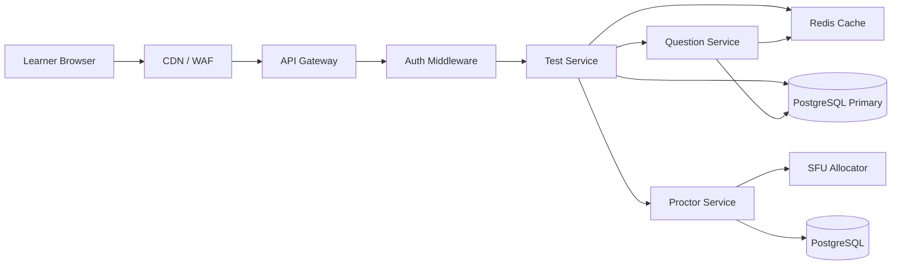

---

### Start-Test Request Path

When a learner clicks "Start Test":

```text
1. Browser sends POST /api/v1/tests/{test_id}/sessions.
2. API Gateway validates rate limits and JWT.
3. Test Service checks whether the learner already has an active session.
4. Test Service creates a TestSession row in PostgreSQL.
5. Test Service loads test configuration from Redis.
6. Question Service selects the first question near starting difficulty.
7. If proctoring is required, Proctor Service creates ProctoringSession.
8. Response returns session_id, first question, and proctoring bootstrap data if required.
```

---

### Load Estimate

#### Start-Test API Load

```text
50,000 learners / 300 seconds = ~167 requests/second
```

With a 3x burst factor:

```text
167 × 3 = ~501 requests/second
```

Target capacity:

```text
500 start-test requests/second
```

---

#### Application Server Sizing

Assumption:

```text
One Test Service instance can safely handle ~100 start-test requests/second.
```

Required instances:

```text
500 / 100 = 5 instances
```

Add 2x safety margin:

```text
10 Test Service instances
```

Recommended deployment:

```text
Test Service: 10 pods
Question Service: 6 pods
Auth Service: 4 pods
Proctor Service: 8 pods
```

---

#### Database Write Load

Each start-test request creates approximately:

```text
1 TestSession row
1 AuditLog row
1 ProctoringSession row, if proctoring enabled
```

For 50,000 learners:

Without proctoring:

```text
50,000 TestSession inserts
50,000 AuditLog inserts
= 100,000 writes over 300 seconds
= ~333 writes/second
```

With proctoring:

```text
50,000 TestSession inserts
50,000 AuditLog inserts
50,000 ProctoringSession inserts
= 150,000 writes over 300 seconds
= ~500 writes/second
```

With burst factor:

```text
500 writes/second × 3 = ~1,500 writes/second
```

A properly sized PostgreSQL primary can handle this write rate if:

- Connections are pooled.
- Indexes are controlled.
- Large audit/proctoring writes are batched or async where possible.
- Connection pooling is handled by PgBouncer.

---

### Cache Behavior

Test configuration and question pools are pre-warmed before the exam window.

Cached data:

```text
test_config:{test_id}
question_pool:{test_id}
question_exposure:{question_version_id}
question_versions:{test_id}
proctoring_rule:{test_id}
```

Exposure counters are maintained primarily in Redis and periodically flushed to PostgreSQL to avoid write hotspots on heavily-used questions.

Expected cache behavior:

```text
First few requests warm the cache.
Most remaining 50,000 requests hit Redis.
Database is not repeatedly queried for static test configuration.
```

Redis read load:

```text
~500 start requests/second × 2–4 cache reads
= ~1,000–2,000 Redis ops/second
```

This is well within normal Redis capacity.

---

### Question Selection at Start

The first question is selected near the configured starting difficulty.

For example:

```text
starting_difficulty = 0
```

The Question Service selects a published question version with difficulty near 0 from the test's question pool.

To avoid all learners receiving the exact same first question:

```text
Select from top N matching questions, not only the single closest question.
```

Example:

```text
Find the top N eligible questions closest to the target difficulty,
where N = tests.randomization_n.

Filter out:

- Retired questions
- Previously answered questions
- Questions whose exposure_count >= max_exposure

Randomly select one candidate from the remaining pool.
```

This reduces question-bank leakage during mass starts.

---

### Start Window Sequence Diagram

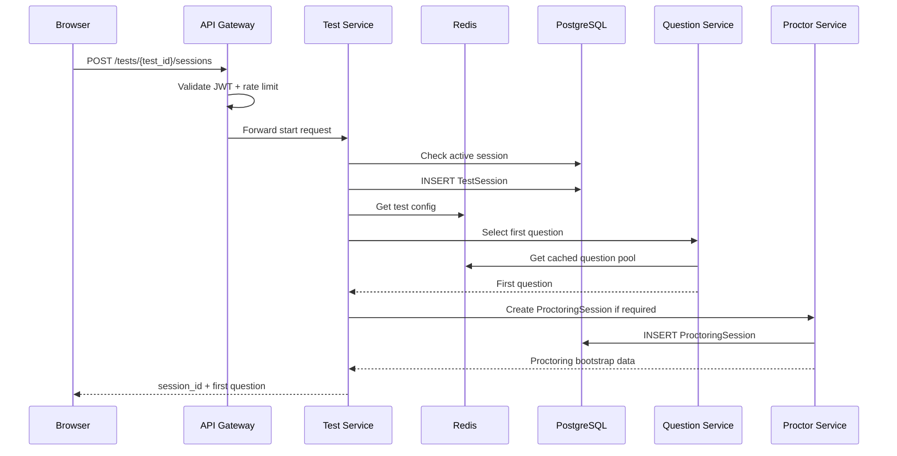


---

### Bottleneck Controls During Start Spike

#### 1. API Gateway

Controls:

```text
Rate limits per learner, IP, and institution.
Request validation before reaching services.
Autoscaling based on request rate and latency.
```

#### 2. PostgreSQL

Controls:

```text
PgBouncer connection pooling.
Short transactions.
Minimal indexes on high-write tables.
Async audit logging where possible.
Partition large append-only tables.
```

#### 3. Question Selection

Controls:

```text
Pre-warmed Redis question pools.
Top-N randomized selection.
Exposure counters stored in Redis.
Fallback to cached pool if database is slow.
```

#### 4. Proctoring Bootstrap

Controls:

```text
Pre-warmed SFU capacity.
Regional SFU allocation.
Short-lived TURN credentials.
Async ML pipeline startup.
```

---

### Expected Behavior Under Load

At 50,000 learners in 5 minutes, the system behaves as follows:

```text
API Gateway absorbs and smooths bursts.
Test Service scales horizontally.
PostgreSQL handles transactional session creation.
Redis serves static test/question configuration.
Question Service selects first questions from cached pools.
Proctor Service allocates SFU/TURN resources independently.
Audit and analytics events are pushed asynchronously.
```

The learner receives a response containing:

```text
test_session_id
first_question
current ability estimate
standard error
proctoring connection details, if applicable
```

Target response time:

```text
p95 start-test latency: < 1.5 seconds
p99 start-test latency: < 3 seconds
```

If the system is temporarily overloaded:

```text
The API Gateway returns controlled 429 responses.
The client retries with exponential backoff.
No duplicate active sessions are created due to database constraints.
```

---

### Integrity During Mass Start

To prevent duplicate active sessions during retries:

```sql
CREATE UNIQUE INDEX idx_one_active_session_per_user_test
ON test_sessions(user_id, test_id)
WHERE status = 'active';
```

If the learner retries the start request after timeout:

```text
The system returns the existing active session instead of creating a new one.
```

This makes the start flow safe under high concurrency and unstable network conditions.

---

<a id="b-bottlenecks-ranked-top-3"></a>

## b. Bottlenecks Ranked: Top 3

The main bottlenecks are ranked by their likelihood of becoming system-limiting during a 50,000-learner exam window.

---

### Bottleneck 1: Video Proctoring Infrastructure

This is the largest bottleneck because every learner may stream webcam and microphone data continuously during the exam.

#### Load Estimate

Assumption:

```text
Concurrent learners: 50,000
Average webcam stream bitrate: 400 kbps
```

Total inbound media bandwidth:

```text
50,000 × 400 kbps = 20,000,000 kbps
= 20 Gbps
```

If screen recording is also enabled, bandwidth can increase significantly:

```text
Estimated screen share bitrate: 800 kbps
Total additional bandwidth = 50,000 × 800 kbps = 40 Gbps
```

Worst case with webcam + screen share:

```text
20 Gbps + 40 Gbps = 60 Gbps inbound media traffic
```

#### SFU Capacity Estimate

Assumption:

```text
1 SFU node supports ~500 concurrent learner streams
```

Required SFU nodes:

```text
50,000 / 500 = 100 SFU nodes
```

Recommended capacity with 30% headroom:

```text
100 × 1.3 = 130 SFU nodes
```

#### Diagram

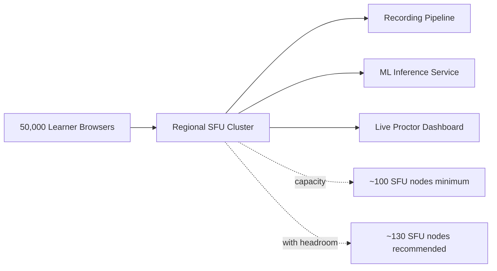


#### Why It Is Ranked #1

Video traffic is much heavier than normal API traffic. The adaptive testing API may handle thousands of requests per second, but video proctoring creates continuous high-bandwidth load for the entire exam duration.

#### Mitigations

- Deploy SFU clusters per region.
- Use GeoDNS or latency-based routing.
- Pre-warm SFU nodes before exam windows.
- Use TURN only when direct WebRTC connection fails.
- Keep webcam quality moderate, e.g. 640×480 at 15 FPS.
- Use adaptive bitrate.
- Sample frames for ML instead of processing every frame.
- Disable screen recording except for high-stakes exams.

---

### Bottleneck 2: ML Inference Pipeline

The ML service processes sampled frames from proctoring streams for face detection, gaze estimation, object detection, and audio anomaly detection.

#### Load Estimate

Assumption:

```text
Concurrent learners: 50,000
Frame sampling rate: 1 FPS per learner
```

Inference load:

```text
50,000 × 1 frame/second = 50,000 frames/second
```

Assumption:

```text
1 GPU handles ~1,000 learner streams at 1 FPS
```

Required GPUs:

```text
50,000 / 1,000 = 50 GPUs
```

Recommended capacity with 20% headroom:

```text
50 × 1.2 = 60 GPUs
```

#### Event Volume Estimate

Assumption:

```text
Average ML event rate: 1 event per 10 seconds per learner
```

Event throughput:

```text
50,000 / 10 = 5,000 events/second
```

#### Diagram

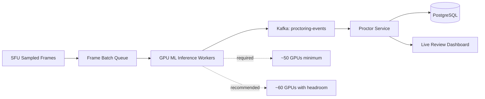


#### Why It Is Ranked #2

ML inference is compute-heavy and GPU-bound. If inference cannot keep up, proctoring events become delayed, live alerts become stale, and reviewer queues become less useful.

#### Mitigations

- Sample at 1 FPS instead of full video frame rate.
- Batch frames in groups of 64–128.
- Autoscale GPU workers before exam windows.
- Use lower-cost CPU models for low-risk checks.
- Prioritize high-risk sessions for real-time inference.
- Process lower-severity detections asynchronously.
- Use Kafka to absorb bursts.
- Track inference lag as a critical SLO.

---

### Bottleneck 3: PostgreSQL Primary Write Path

The core LMS relies on PostgreSQL for transactional correctness during session creation, answer submission, ability updates, audit logs, and proctoring metadata.

#### Start-Test Write Load

For 50,000 learners starting over 5 minutes:

```text
50,000 learners / 300 seconds = ~167 starts/second
```

Each start creates approximately:

```text
1 TestSession row
1 AuditLog row
1 ProctoringSession row
```

Write rate:

```text
167 × 3 = ~501 writes/second
```

With 3x burst factor:

```text
501 × 3 = ~1,503 writes/second
```

#### Answer Submission Load

Assumption:

```text
Each learner submits 1 answer every 30 seconds
```

Answer submissions:

```text
50,000 / 30 = ~1,667 answer submissions/second
```

Each answer submission performs approximately:

```text
1 Answer insert
1 TestSession update

Audit logging is emitted asynchronously through Kafka and does not block answer submission.
```

Write rate:

```text
1,667 × 3 = ~5,001 writes/second
```

#### Combined Transactional Write Pressure

During overlap between starts and answer submissions:

```text
Start writes: ~1,503 writes/second burst
Answer writes: ~5,001 writes/second
Total: ~6,504 writes/second
```

#### Diagram

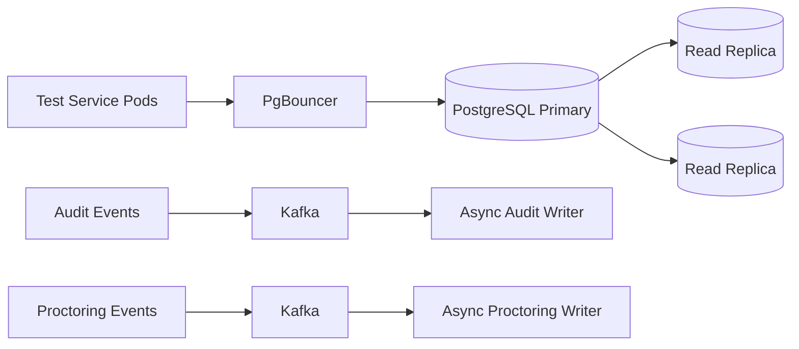


#### Why It Is Ranked #3

PostgreSQL is not the highest raw-throughput component, but it is the correctness boundary. Answer submission requires transactions, row locks, unique constraints, and session state updates. If the primary database slows down, the core exam flow slows down.

#### Mitigations

- Use PgBouncer connection pooling.
- Keep answer-submission transactions short.
- Use `SELECT ... FOR UPDATE` only on the relevant `TestSession` row.
- Use unique constraints for duplicate-answer protection.
- Move audit logging to Kafka-backed async writes where possible.
- Partition large append-only tables such as `answers`, `audit_log`, `video_chunks`, and `proctoring_events`.
- Use read replicas for dashboards and reporting.
- Cache question pools and test config in Redis.
- Avoid unnecessary indexes on high-write tables.

---

### Summary Ranking


| Rank | Bottleneck                    | Why It Matters                                | Estimated Load                                         |
| ---- | ----------------------------- | --------------------------------------------- | ------------------------------------------------------ |
| 1    | Video Proctoring / SFU        | Continuous high-bandwidth traffic             | ~20 Gbps webcam only, up to ~60 Gbps with screen share |
| 2    | ML Inference Pipeline         | GPU-bound real-time analysis                  | ~50,000 frames/sec at 1 FPS                            |
| 3    | PostgreSQL Primary Write Path | Correctness boundary for sessions and answers | ~5,000+ writes/sec during answer flow                  |


The core adaptive testing API is horizontally scalable, but the system's true scaling risks are concentrated in media streaming, ML inference, and transactional database writes.

---

<a id="c-scaling-plan-for-10x-load"></a>

## c. Scaling Plan for 10x Load

The current target is:

```text
50,000 concurrent learners
```

A 10x load means:

```text
500,000 concurrent learners
```

At this scale, the largest risks are video bandwidth, ML inference, and database write throughput.

---

### Baseline vs 10x Load


| Metric                                 | 50,000 Learners | 500,000 Learners |
| -------------------------------------- | --------------- | ---------------- |
| Start requests over 5 minutes          | 50,000          | 500,000          |
| Average start RPS                      | 167 RPS         | 1,667 RPS        |
| Burst start RPS, 3x                    | 500 RPS         | 5,000 RPS        |
| Answer submissions, 1 per 30s          | 1,667 RPS       | 16,667 RPS       |
| Approx answer writes, 3 writes/request | 5,001 writes/s  | 50,001 writes/s  |
| Webcam bandwidth at 400 kbps           | 20 Gbps         | 200 Gbps         |
| SFU nodes at 500 streams/node          | 100 nodes       | 1,000 nodes      |
| ML frames at 1 FPS                     | 50,000 FPS      | 500,000 FPS      |
| GPUs at 1,000 streams/GPU              | 50 GPUs         | 500 GPUs         |
| Proctoring events, 1 per 10s           | 5,000 events/s  | 50,000 events/s  |


---

### Add First: Regional Proctoring and Media Plane Scaling

The first thing to scale is the proctoring media plane because it is the highest-volume part of the system.

At 500,000 learners:

```text
500,000 × 400 kbps = 200 Gbps inbound webcam traffic
```

If screen recording is enabled:

```text
500,000 × 800 kbps = 400 Gbps additional traffic
```

Worst case:

```text
200 Gbps + 400 Gbps = 600 Gbps inbound media traffic
```

#### Required SFU Capacity

Assumption:

```text
1 SFU node supports 500 learner streams
```

Required nodes:

```text
500,000 / 500 = 1,000 SFU nodes
```

With 30% headroom:

```text
1,000 × 1.3 = 1,300 SFU nodes
```

#### Architecture Addition

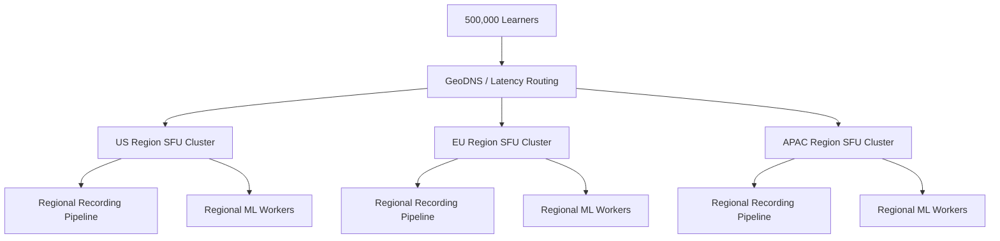


#### What Changes

Add:

- Regional SFU clusters.
- Regional TURN/STUN clusters.
- GeoDNS or latency-based routing.
- Pre-warmed SFU node pools.
- Adaptive bitrate.
- Regional object storage buckets.
- Regional ML workers.

#### Why This Comes First

The media plane creates far more load than the core test API.

The answer submission API may be scaled horizontally, but 200–600 Gbps of video traffic requires regional infrastructure and capacity planning first.

---

### Add Second: Shard the Core Test Session Write Path

At 500,000 learners, answer submission becomes a major transactional bottleneck.

Assumption:

```text
1 answer every 30 seconds per learner
```

Answer submissions:

```text
500,000 / 30 = 16,667 submissions/second
```

Each submission writes:

```text
1 Answer insert
1 TestSession update
1 Audit event
```

Write pressure:

```text
16,667 × 3 = ~50,001 writes/second
```

A single PostgreSQL primary should not be expected to handle this safely while also maintaining strict latency and row-locking guarantees.

#### Architecture Addition

Shard by `test_session_id` or `institution_id`.

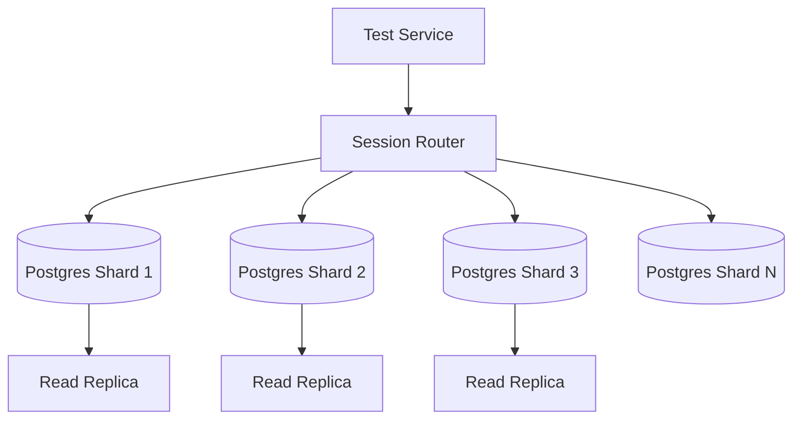


#### Sharding Strategy

Use:

```text
shard_key = hash(test_session_id)
```

or for institutional isolation:

```text
shard_key = institution_id
```

Recommended:

```text
institution_id for large enterprise/university tenants
test_session_id hash for very large shared pools
```

#### Example

If each PostgreSQL shard is sized for:

```text
5,000 writes/second
```

Required shards:

```text
50,001 / 5,000 = ~10 shards
```

With headroom:

```text
12–16 shards
```

#### What Changes

Add:

- Session routing layer.
- Multiple PostgreSQL primaries.
- Per-shard PgBouncer pools.
- Read replicas per shard.
- Partitioned append-only tables.
- Kafka-backed async audit logging.
- Cross-shard reporting pipeline.

#### Why This Comes Second

After media infrastructure, the database write path is the core correctness bottleneck.

Answer submission requires transactions, row locks, uniqueness checks, and ability updates. Sharding keeps each learner session local to one database shard while allowing total system throughput to scale.

---

### Add Third: Event-Driven Async Pipelines for Audit, Analytics, and Proctoring Events

At 500,000 learners, synchronous writes for non-critical data can overload the transactional system.

Proctoring event load:

```text
1 event per 10 seconds per learner
```

At 500,000 learners:

```text
500,000 / 10 = 50,000 events/second
```

Audit events:

```text
At least 1 audit event per answer submission
= ~16,667 audit events/second
```

Combined event flow:

```text
50,000 + 16,667 = ~66,667 events/second
```

#### Architecture Addition

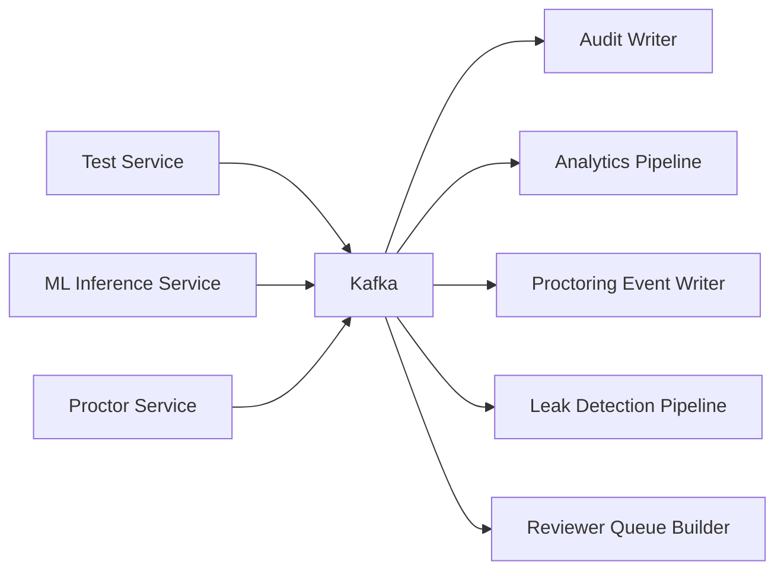


#### Kafka Sizing

Assumption:

```text
1 Kafka broker handles ~10,000-20,000 events/second safely, depending on payload size and replication factor
```

For:

```text
~66,667 events/second
```

Recommended:

```text
8–12 Kafka brokers
```

with partitions by:

```text
test_session_id
proctoring_session_id
institution_id
```

#### What Changes

Move these out of the synchronous request path:

- Audit log writes
- Analytics events
- Proctoring event persistence
- Reviewer queue scoring
- Question exposure analytics
- Leak detection
- Notification events

Only integrity-critical writes remain synchronous:

```text
Answer insert
TestSession update
Current question update
```

#### Why This Comes Third

It reduces pressure on the transactional database and keeps the learner-facing API fast even when analytics, audit, and proctoring event volume spikes.

---

### Final 10x Architecture

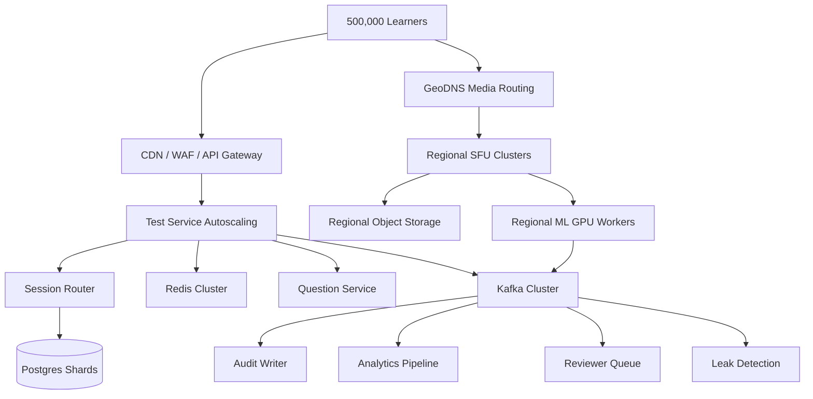


---

### Ordered Scaling Plan

#### First: Scale the Media Plane

Add regional SFU/TURN clusters and regional ML workers.

Reason:

```text
Video traffic grows from 20 Gbps to 200+ Gbps.
```

This is the largest physical infrastructure bottleneck.

---

#### Second: Shard PostgreSQL by Session or Institution

Reason:

```text
Answer-write pressure grows to ~50,000 writes/second.
```

A single primary database becomes too risky.

---

#### Third: Move Non-Critical Writes to Kafka Pipelines

Reason:

```text
Audit + proctoring events may exceed ~66,000 events/second.
```

Asynchronous pipelines keep learner-facing flows fast and reliable.

---

### Summary


| Order | Addition                           | Main Problem Solved                  |
| ----- | ---------------------------------- | ------------------------------------ |
| 1     | Regional SFU/TURN + ML media plane | 200–600 Gbps video traffic           |
| 2     | PostgreSQL sharding                | ~50,000 answer-related writes/sec    |
| 3     | Kafka async event pipelines        | ~66,000+ audit/proctoring events/sec |


This 10x plan keeps the core test path correct while scaling high-volume media, transactional writes, and event processing independently.

---

<a id="d-preventing-question-bank-leakage-at-product-and-system-level"></a>

## d. Preventing Question-Bank Leakage at Product and System Level

Question-bank leakage is one of the highest business risks in an examination platform.

A single screenshot shared across social media, Discord, Telegram, WhatsApp, or exam-prep communities can permanently reduce the value of a question.

The system assumes:

```text
50,000 learners
40 questions per learner
```

Potential exposure:

```text
50,000 × 40 = 2,000,000 question views
```

Even a very small leakage rate can expose thousands of questions.

---

### Threat Model

Example attack:

```text
Learner A
     |
     v
Screenshot Question
     |
     v
Discord / Telegram Group
     |
     v
Future Learners Receive Answers
```

Result:

```text
Ability estimation becomes biased.
Question difficulty calibration becomes invalid.
Exam integrity decreases.
```

---

### Defense-In-Depth Strategy

The platform uses multiple layers of protection.

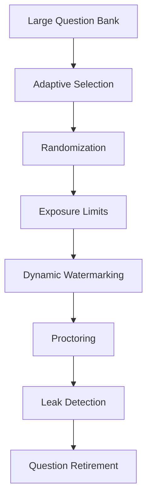


No single control is sufficient.

The goal is to make leaked questions statistically insignificant.

---

### Product-Level Controls

#### 1. Large Question Pool

Assume:

```text
Question bank size = 20,000 questions
```

Adaptive exam:

```text
40 questions per learner
```

Questions shown during one exam:

```text
40 / 20,000

= 0.2% of bank
```

A learner only sees a tiny fraction of the total bank.

---

#### 2. Adaptive Testing Reduces Overlap

Without adaptivity:

```text
50,000 learners
same 40 questions
```

Exposure:

```text
40 questions exposed 50,000 times
```

---

With adaptive testing:

```text
Beginner learners see easy questions
Intermediate learners see medium questions
Advanced learners see hard questions
```

Question overlap drops significantly.

Example:

```text
Question bank: 20,000

Difficulty -4 to +4

Each learner sees:
~40 questions

Overlap between two random learners:
typically <10 questions
```

---

#### 3. Question Randomization

For MCQs:

Randomize:

```text
Option order
Question order
Section order
```

Example:

Learner A:

```text
A = Linked List
B = Queue
C = HashMap
D = Tree
```

Learner B:

```text
A = Tree
B = HashMap
C = Linked List
D = Queue
```

A shared screenshot is less useful.

---

### 4. Exposure Limits

Each question tracks:

```text
times_served
```

Example:

```text
max_exposure = 5,000
```

When exceeded:

```text
question becomes inactive
```

Query:

```sql
SELECT *
FROM question_versions
WHERE status = 'published'
  AND exposure_count < max_exposure
ORDER BY ABS(difficulty - :ability)
LIMIT :randomization_n;
```

Application randomly selects one candidate from the returned set. This prevents a small subset of questions from dominating exam traffic.

---

### System-Level Controls

#### 5. Dynamic Watermarking

Every rendered question contains invisible learner-specific identifiers.

Example:

```text
Learner ID
Session ID
Timestamp
```

Rendered watermark:

```text
Candidate: U-48291
Session: S-91284
```

or hidden CSS/DOM watermark.

Diagram:

```mermaid
flowchart LR
    A[Question Renderer] --> B[Insert Watermark] --> C[Learner Screen]

    C --> D[Screenshot Shared]
    D --> E[Investigate Source]
```


If screenshots appear online:

```text
Source learner can be identified.
```

---

#### 6. One-Question-at-a-Time Delivery

Do NOT send:

```text
40 questions
```

in one API response.

Instead:

```text
Question 1
      ↓
Answer
      ↓
Question 2
      ↓
Answer
```

API:

```http
POST /answers
60 requests/minute per learner
```

returns:

```json
{
  "next_question": { ... }
}
```

This limits mass scraping.

---

#### 7. No Correct Answers in Client APIs

Never return:

```json
{
  "correct_answer": "B"
}
```

during the exam.

Correct answers remain server-side.

---

#### 8. Signed Question Payloads

Question payload:

```text
question_version_id
prompt
options
expiration
```

can be signed using HMAC.

```text
payload_signature = HMAC(secret, payload)
```

Client cannot modify:

```text
difficulty
question_id
correct answer metadata
```

without detection.

---

### Proctoring Controls

#### 9. Screenshot Risk Signals

Proctoring detects:

```text
Tab switches
Window focus loss
Screen-share interruption
Multiple devices
Phone detection
```

Events:

```text
tab_switch
phone_detected
screen_share_stopped
```

Repeated events increase:

```text
severity_score
```

---

#### 10. Reviewer Escalation

Example:

```text
3 screenshots suspected
+
phone detected
+
multiple tab switches
```

Result:

```text
Session flagged for review
```

---

### Leak Detection Pipeline

Question exposure analytics run continuously.

Metrics:

```text
question_exposure_rate
question_success_rate
difficulty_shift
```

Example:

Historical:

```text
Question Q123

Difficulty = 2.1
Success Rate = 48%
```

Suddenly:

```text
Success Rate = 93%
```

This is suspicious.

Diagram:

```mermaid
flowchart LR
    A[Answer Data] --> B[Analytics Pipeline] --> C[Difficulty Drift Detection] --> D[Flag Question] --> E[Retire Question]
```


---

### Question Retirement Strategy

When leakage is suspected:

```text
status = retired
```

Question immediately disappears from selection.

```sql
UPDATE question_versions
SET status='retired'
WHERE id = :question_id;
```

New version:

```text
QuestionVersion v2
```

can replace it.

---

### Quantitative Impact

Assume:

```text
Question bank = 20,000
Questions per learner = 40
Learners = 50,000
```

Without controls:

```text
Same 40 questions shown to everyone
```

Exposure:

```text
40 questions exposed 50,000 times
```

---

With adaptive selection + exposure caps:

```text
20,000-question bank
Exposure cap = 5,000
```

Maximum exposure:

```text
Any single question ≤ 5,000 learners
```

Reduction:

```text
50,000 → 5,000

90% reduction
```

---

### Summary

The platform prevents question-bank leakage through:

1. Large question pools.
2. Adaptive testing with low overlap.
3. Randomized ordering.
4. Exposure caps.
5. Top-N adaptive randomization.
6. Dynamic learner-specific watermarking.
7. One-question-at-a-time delivery.
8. No client-side answer exposure.
9. Signed question payloads.
10. Proctoring-based screenshot risk signals.
11. Automated leak detection and question retirement.

Together these controls ensure that even if individual questions are leaked, the statistical impact on the overall adaptive assessment remains small and manageable.

---

<a id="e-additional-bandwidth-and-compute-load-from-video-proctoring"></a>

## e. Additional Bandwidth and Compute Load from Video Proctoring

Video proctoring introduces the largest non-API load in the system. Unlike answer submission, which is bursty and request-based, video proctoring creates continuous bandwidth, storage, ML inference, and event-processing load for the full exam duration.

---

### Assumptions

```text
Concurrent learners: 50,000
Webcam stream bitrate: 400 kbps average
Webcam resolution: 640×480
Frame rate: 15 FPS
ML sampling rate: 1 FPS per stream
Video chunk duration: 5 seconds
Average exam duration: 60 minutes
Average ML event rate: 1 event per 10 seconds per learner
```

---

### Media Inbound Bandwidth

Each learner streams webcam and microphone data to the SFU.

```text
50,000 learners × 400 kbps = 20,000,000 kbps
```

```text
20,000,000 kbps = 20 Gbps
```

So the SFU layer must handle approximately:

```text
20 Gbps inbound media traffic
```

---

### Optional Screen Recording Bandwidth

If screen recording is enabled, assume:

```text
Screen share bitrate: 800 kbps average
```

Additional bandwidth:

```text
50,000 × 800 kbps = 40,000,000 kbps
```

```text
40,000,000 kbps = 40 Gbps
```

Total with webcam and screen share:

```text
20 Gbps + 40 Gbps = 60 Gbps inbound traffic
```

---

### SFU Cluster Sizing

Assumption:

```text
1 SFU node supports ~500 concurrent learner streams
```

Minimum SFU nodes:

```text
50,000 / 500 = 100 nodes
```

With 30% headroom:

```text
100 × 1.3 = 130 nodes
```

Recommended:

```text
100 SFU nodes minimum
130 SFU nodes provisioned
```

---

### Media Flow Diagram

```mermaid
flowchart LR
    A[50,000 Learner Browsers] --> B[Regional SFU Cluster]

    B --> C[Recording Pipeline]
    B --> D[ML Frame Sampler]
    B --> E[Live Proctor Dashboard]

    C --> F[Object Storage]
    D --> G[ML Inference Workers]
    G --> H[Kafka Proctoring Events]
    H --> I[Proctor Service]
```


---

### ML Inference Compute Load

The ML Inference Service does not process every video frame.

Instead, it samples frames.

```text
Webcam frame rate: 15 FPS
ML sampling rate: 1 FPS
```

Frames sent for ML:

```text
50,000 learners × 1 FPS = 50,000 frames/second
```

Assumption:

```text
1 GPU can process ~1,000 streams at 1 FPS
```

Minimum GPUs:

```text
50,000 / 1,000 = 50 GPUs
```

With 20% headroom:

```text
50 × 1.2 = 60 GPUs
```

Recommended:

```text
50 GPUs minimum
60 GPUs provisioned
```

---

### ML Pipeline Diagram

```mermaid
flowchart LR
    A[SFU Sampled Frames] --> B[Frame Batch Queue]

    B --> C[GPU Inference Workers]

    C --> D[Face Detection]
    C --> E[Gaze Estimation]
    C --> F[Object Detection]
    C --> G[Audio Analysis]

    D --> H[ProctoringEvent]
    E --> H
    F --> H
    G --> H

    H --> I[Kafka Topic: proctoring-events]
```


---

### Object Storage Load

Video is stored in 5-second chunks.

Chunks per learner per hour:

```text
60 minutes × 60 seconds = 3,600 seconds
```

```text
3,600 / 5 = 720 chunks per learner per hour
```

For 50,000 learners:

```text
50,000 × 720 = 36,000,000 chunks per hour
```

PUT request rate:

```text
36,000,000 / 3,600 = 10,000 PUT requests/second
```

Approximate video storage per hour at 400 kbps:

```text
400 kbps = 50 KB/s
```

Per learner per hour:

```text
50 KB/s × 3,600 = 180,000 KB
≈ 180 MB/hour
```

For 50,000 learners:

```text
50,000 × 180 MB = 9,000,000 MB
≈ 9,000 GB
≈ 9 TB/hour
```

With screen recording at additional 800 kbps:

```text
Additional storage ≈ 18 TB/hour
```

Total webcam + screen recording:

```text
9 TB/hour + 18 TB/hour = 27 TB/hour
```

---

### Kafka / Event Bus Load

Assumption:

```text
1 proctoring event per 10 seconds per learner
```

Event rate:

```text
50,000 / 10 = 5,000 events/second
```

With burst factor 2x:

```text
5,000 × 2 = 10,000 events/second
```

Kafka topic:

```text
proctoring-events
```

Partitioning key:

```text
proctoring_session_id
```

This preserves event ordering per session while allowing horizontal scale across partitions.

---

### Database Write Load from Proctoring

Not every frame is stored in PostgreSQL.

PostgreSQL stores metadata only:

- ProctoringSession
- VideoChunk metadata
- ProctoringEvent
- Reviewer decisions

Video and snapshots are stored in object storage.

#### VideoChunk Metadata Writes

At 5-second chunks:

```text
10,000 chunks/second
```

If each chunk creates one metadata row:

```text
10,000 VideoChunk inserts/second
```

This is high, so the system should batch metadata writes or store chunk manifests per session.

Optimization:

```text
Write one manifest record per 1-minute segment instead of one row per 5-second chunk.
```

This reduces metadata writes by:

```text
60 seconds / 5 seconds = 12x
```

Optimized metadata write rate:

```text
10,000 / 12 ≈ 833 writes/second
```

#### ProctoringEvent Writes

```text
~5,000 events/second average
~10,000 events/second burst
```

These are written through Kafka consumers, not directly from the ML service to PostgreSQL.

---

### Recommended Capacity Summary


| Component                        | Estimated Load         | Recommended Capacity        |
| -------------------------------- | ---------------------- | --------------------------- |
| SFU inbound webcam bandwidth     | 20 Gbps                | 100–130 SFU nodes           |
| Webcam + screen share bandwidth  | 60 Gbps                | Regional SFU clusters       |
| ML frame processing              | 50,000 FPS             | 50–60 GPUs                  |
| Object storage video data        | ~9 TB/hour webcam only | Lifecycle retention         |
| Object storage with screen share | ~27 TB/hour            | High-volume bucket strategy |
| Object storage PUT rate          | ~10,000 PUT/s          | Multipart/chunked upload    |
| Kafka proctoring events          | 5,000–10,000 events/s  | Partitioned topic           |
| VideoChunk metadata writes       | 10,000/s raw           | Batch to ~833/s             |
| ProctoringEvent writes           | 5,000–10,000/s         | Async Kafka consumers       |


---

### Mitigations

To keep video proctoring scalable:

- Keep webcam stream at 640×480 and 15 FPS.
- Sample ML frames at 1 FPS instead of processing full video.
- Use SFU forwarding instead of full decode/re-encode.
- Deploy SFU and TURN clusters per region.
- Batch ML inference frames.
- Write video to object storage, not PostgreSQL.
- Store metadata only in PostgreSQL.
- Use Kafka for proctoring events.
- Batch VideoChunk metadata into manifests.
- Use lifecycle policies to delete raw video after the retention window.
- Enable screen recording only for high-stakes exams.

---

### Conclusion

For 50,000 concurrent learners, the core adaptive test API is not the largest load.

The video proctoring subsystem introduces:

```text
20–60 Gbps media bandwidth
50,000 ML frames/second
9–27 TB video storage per hour
5,000–10,000 proctoring events/second
```

Therefore, proctoring must be scaled as an independent media and ML platform, separate from the core LMS request/response path.

```

```

<a id="7-architecture-decision-records-3-adrs"></a>

# 7. Architecture Decision Records (3 ADRs)

<a id="adr-1-database-choice-postgresql-vs-mongodb"></a>

## ADR-1: Database Choice (PostgreSQL vs MongoDB)

### Context

The adaptive LMS must support:

- 50,000+ concurrent learners
- Adaptive test sessions
- Real-time answer submission
- Strict data integrity requirements
- Video proctoring metadata
- Audit logging
- Prevention of duplicate submissions and replay attacks

The primary candidates were PostgreSQL and MongoDB.

---

### Decision

We will use PostgreSQL as the primary system of record.

---

### Consequences

#### Positive

- ACID transactions ensure answer submissions and ability updates remain consistent.
- Row-level locking (`SELECT ... FOR UPDATE`) prevents concurrent request corruption.
- Unique constraints prevent duplicate answers.
- Strong relational modeling naturally represents users, tests, sessions, answers, and proctoring entities.
- Mature indexing and query optimization support adaptive test workloads.
- JSONB columns provide flexibility for metadata and audit records without sacrificing relational integrity.

#### Negative

- Horizontal scaling is more complex than MongoDB.
- Schema migrations require greater operational discipline.
- Write throughput eventually becomes constrained by a single primary node.

#### Mitigations

- Redis caches test configuration, question pools, and exposure counters.
- PostgreSQL read replicas support dashboards, reporting, and analytics.
- Audit and proctoring events are written asynchronously through Kafka.
- Large append-only tables such as Answers, AuditLog, ProctoringEvent, and VideoChunk manifests are partitioned.
- Exposure counters are maintained in Redis and periodically flushed to PostgreSQL.
- Future scaling may introduce shard-local PostgreSQL clusters while retaining PostgreSQL as the transactional source of truth.

---

#### Future Horizontal Scaling

At very large scale (e.g. 500,000+ concurrent learners), PostgreSQL can be horizontally scaled by sharding TestSessions and related entities.

All rows associated with a TestSession should remain on the same shard:

- TestSession
- Answers
- ProctoringSession

This preserves local ACID transactions for answer submission.

### Why MongoDB Was Rejected

MongoDB provides flexible document storage and easier horizontal scaling. However:

- Multi-document consistency is weaker than PostgreSQL's transactional model.
- Adaptive testing requires strong guarantees around answer submission ordering and session state updates.
- The domain is highly relational, with many foreign-key relationships.
- Preventing duplicate answers and enforcing integrity is simpler and more reliable in PostgreSQL.

For these reasons, PostgreSQL provides the best balance of consistency, maintainability, and scalability for the adaptive LMS.

---

<a id="adr-2-adaptive-algorithm-choice"></a>

## ADR-2: Adaptive Algorithm Choice

### Context

The LMS must estimate a learner's ability in real time and select the next question based on their previous answers.

The assessment requires that the algorithm must not use a naive difficulty walk such as:

```text
Correct answer   → increase difficulty by 1
Incorrect answer → decrease difficulty by 1
```

That approach is too simplistic because it:

- Does not estimate learner ability statistically.
- Does not measure confidence.
- Overreacts to lucky guesses or accidental mistakes.
- Cannot support confidence-based early termination.
- Does not use question difficulty in a principled way.

The main options considered were:

1. Item Response Theory using a 1-parameter Rasch model
2. Elo-style learner/question rating updates
3. Bayesian posterior ability estimation

---

### Decision

We will use **Item Response Theory (IRT)** with a **1-Parameter Logistic Rasch Model**.

The model represents:

```text
θ = learner ability
b = question difficulty
```

The probability of a correct answer is:

```text
P(correct) = 1 / (1 + e^(-(θ - b)))
```

The learner's ability estimate is updated after each answer.

The adaptive engine:

1. Filters out previously answered questions.
2. Filters out questions whose exposure_count >= max_exposure.
3. Finds the top N closest questions by difficulty, where N = randomization_n.
4. Randomly selects one candidate from that set.

This reduces question-bank leakage while preserving adaptive behavior.

The system also tracks test information and standard error:

```text
I = P × (1 - P)

SE = 1 / √I_total
```

The test ends when either:

```text
questions_answered >= max_questions
```

or:

```text
SE < configured_threshold
```

---

### Why Rasch IRT Was Selected

The Rasch model was selected because it provides the best balance of:

- Statistical correctness
- Explainability
- Implementation simplicity
- Real-time performance
- Confidence estimation
- Early termination support

It is more rigorous than Elo-style updates while being easier to implement and operate than a full Bayesian posterior model.

---

### Alternatives Considered

#### Option 1: Elo-Style Updates

Elo-style updates treat the learner and the question like two rated players.

A correct answer increases learner rating and decreases question rating.

**Pros:**

- Simple to implement.
- Fast to compute.
- Easy to explain to engineers.

**Cons:**

- Weaker statistical foundation for educational measurement.
- Does not naturally provide confidence intervals.
- Early termination would require additional heuristics.
- Less standard for formal adaptive testing.

Rejected because confidence estimation and defensibility are important for high-stakes assessments.

---

#### Option 2: Bayesian Posterior Ability Estimation

Bayesian estimation maintains a full probability distribution over learner ability.

**Pros:**

- Strong uncertainty modeling.
- Natural confidence intervals.
- Handles priors well.

**Cons:**

- More complex to implement.
- Higher compute cost.
- Harder to explain and debug.
- More operational complexity for production version.

Rejected because the additional complexity is not necessary to meet the system requirements.

---

### Consequences

#### Positive

- Ability estimation is statistically grounded.
- The system can select questions that maximize measurement information.
- The system can stop early when confidence is high.
- The algorithm is explainable during audits and technical reviews.
- Runtime computation is lightweight enough for high concurrency.
- Question difficulty and learner ability exist on the same scale.
- Exposure limits reduce question-bank leakage.
- Top-N randomization prevents overuse of statistically ideal questions.
- Adaptive selection remains effective even under large concurrent exam windows.

#### Negative

- Requires calibrated question difficulty values.
- Assumes all questions have equal discrimination power.
- Does not explicitly model guessing.
- All-correct or all-wrong answer patterns require bounded estimates.
- Question leakage can distort difficulty calibration.

---

### Mitigations

To make the algorithm production-safe:

- Ability estimates are bounded within configured min_ability and max_ability values.
- Updates are damped using learning_rate.
- Ability changes are capped using max_step_size.
- Exposure limits reduce overuse of individual questions.
- Top-N randomization reduces candidate predictability.
- Question pools are periodically recalibrated.
- Difficulty values are re-estimated from historical response data.
- Question selection excludes previously answered questions.
- Question exposure limits reduce leakage risk.
- Difficulty values are periodically recalibrated using historical response data.
- If guessing becomes a major issue, the system can later evolve to 3PL IRT.

---

### Production-Safe Update Policy

The update uses damping and clamping:

```text
P = 1 / (1 + e^(-(θ - b)))

I = P × (1 - P)

raw_update = (u - P) / max(I, 0.05)

step =
clamp(
    learning_rate × raw_update,
    -max_step_size,
    +max_step_size
)

θ_new = clamp(θ_old + step, -4, +4)
```

Where:

```text
u = 1 for correct answer
u = 0 for incorrect answer
learning_rate and max_step_size are configured per test and stored in the TESTS table.
```

This prevents unstable jumps caused by lucky guesses, misclicks, or very low information questions.

---

### Exposure Control

To reduce question-bank leakage, every QuestionVersion tracks:

```text
exposure_count
max_exposure
```

Questions exceeding their exposure limit are excluded from candidate selection.

Example:
```text
exposure_count >= max_exposure
```

The adaptive engine then selects from the remaining eligible candidates.

Exposure control is used together with Top-N randomization to distribute question usage across the question bank.

### Why 1PL Instead of 2PL or 3PL

The system intentionally starts with a 1-Parameter Logistic Rasch model.

2PL introduces discrimination parameters and 3PL introduces guessing parameters.

While these models may improve statistical accuracy, they require significantly more calibration data and operational complexity.

The 1PL model provides the best balance of:

- Explainability
- Simplicity
- Calibration effort
- Runtime performance
- Auditability

The architecture allows future migration to 2PL or 3PL without changing the overall adaptive-testing workflow.

<a id="adr-3-auth-and-session-strategy"></a>

## ADR-3: Auth and Session Strategy

### Context

The adaptive LMS must support secure test-taking for learners, administrators, reviewers, instructors, and proctors.

The system must protect:

- Learner identity
- Active test sessions
- Answer submissions
- Proctoring streams
- Reviewer actions
- Admin operations

The auth model must also support long-running exams where an access token may expire while the learner is still taking a test.

Important requirements:

- Learners must only access their own test sessions.
- Reviewers must only access proctoring review workflows.
- Admin actions must be restricted and audited.
- Token theft should have limited impact.
- Browser refresh or short disconnect should not force a learner to restart.
- Replay attempts and duplicate submissions must be rejected.

---

### Decision

The system will use:

```text
Short-lived JWT access tokens
+
Rotating opaque refresh tokens
+
Server-side TestSession state
+
Role-based access control
+
Ownership checks
```

Access tokens authorize API requests.

Refresh tokens allow the client to obtain a new access token without forcing the learner to log in again during a long exam.

Test progress is stored server-side in `TestSessions`, not in the browser.

---

### Access Token Strategy

Access tokens are signed JWTs.

Default lifetime:

```text
15 minutes
```

Access tokens are sent using:

```http
Authorization: Bearer <access_token>
```

Example claims:

```json
{
  "sub": "user_123",
  "role": "learner",
  "institution_id": "inst_456",
  "auth_session_id": "auth_session_789",
  "iat": 1770000000,
  "exp": 1770000900
}
```

The API Gateway validates:

- Signature
- Expiration
- Issuer
- Audience
- Role
- Institution scope

---

### Refresh Token Strategy

Refresh tokens are opaque random tokens.

They are:

- Stored server-side as hashed values
- Stored client-side in HttpOnly, Secure, SameSite cookies
- Rotated on every refresh
- Revoked on logout
- Expired after 7 days by default

If a previously rotated refresh token is reused, the system treats it as possible token theft and revokes the entire auth session.

Refresh endpoint:

```http
POST /api/v1/auth/refresh
```

Response:

```json
{
  "access_token": "new.jwt.access.token",
  "expires_in": 900
}
```

---

### Test Session Strategy

Authentication sessions and test sessions are separate concepts.

An auth session proves who the user is.

A test session tracks the learner's active exam state.

`TestSessions` stores:

- `user_id`
- `test_id`
- `status`
- `current_question_version_id`
- `ability_estimate`
- `standard_error`
- `questions_answered`
- `started_at`
- `last_activity_at`
- `expires_at`

This makes the test resumable but not rewindable.

---

### Role-Based Access Control

Primary roles:


| Role       | Permissions                                                                    |
| ---------- | ------------------------------------------------------------------------------ |
| Learner    | Start tests, submit answers, resume own sessions, start own proctoring session |
| Instructor | View assigned tests and learner results                                        |
| Reviewer   | Review proctoring sessions and events                                          |
| Proctor    | Monitor live sessions, warn learners, terminate live sessions if allowed       |
| Admin      | Manage users, roles, exams, questions, and system configuration                |


---

### Ownership Checks

Role checks are not enough.

Learners must also pass ownership checks.

Example:

```text
test_sessions.user_id = authenticated_user.id
```

A learner may submit an answer only if:

```text
session.user_id = authenticated_user.id
session.status = active
submitted_question_version_id = session.current_question_version_id
```

Reviewers and proctors use role-based access and institution-level scoping.

---

### Session Resume Policy

If a learner refreshes the browser or briefly disconnects:

- The test session remains active server-side.
- Ability estimate and standard error are preserved.
- Previously submitted answers remain immutable.
- Submitted answers remain immutable.
- The test timer continues unless exam settings explicitly allow pause-on-disconnect.

Resume is allowed only when:

```text
session.status = active
now < session.expires_at
authenticated_user.id = session.user_id
```

Long disconnects are flagged in `AuditLog` and, if proctoring is enabled, in `ProctoringEvent`.

---

### Completion Behaviour

If:

```text
session.status = completed
```

the learner may review final results but may not continue answering questions.

If:

```text
session.status = terminated
```

the learner may not continue unless an administrator explicitly reopens the session.

### Integrity Protections

During answer submission:

- The backend locks the `TestSession` row using `SELECT ... FOR UPDATE`.
- The submitted question must match the current active question.
- Duplicate answers are rejected with a unique constraint on `(test_session_id, question_version_id)`.
- Idempotency keys allow safe retries.
- Payload hashes distinguish retries from modified replay attempts.
- Suspicious replay attempts are rejected and audited.

---

### Consequences

#### Positive

- Access-token theft has limited impact because tokens expire quickly.
- Refresh-token rotation reduces long-term session hijacking risk.
- Learners can continue long exams without repeated login prompts.
- Server-side `TestSession` state supports safe resume.
- Role checks and ownership checks protect sensitive resources.
- The model works well with API Gateway validation and service-level authorization.

#### Negative

- Refresh-token rotation adds implementation complexity.
- Server-side auth session storage is required.
- Distributed logout and revocation require shared storage.
- More careful handling is needed for multiple devices and browser tabs.

---

### Mitigations

- Store refresh token hashes in PostgreSQL or Redis.
- Use token family IDs to detect refresh token reuse.
- Use device/session metadata for anomaly detection.
- Require MFA for admins, reviewers, and proctors.
- Use short access-token TTLs.
- Record privileged and suspicious actions in `AuditLog`.
- Prevent duplicate answer submissions using a unique constraint on (test_session_id, question_version_id).
- Prevent replay attacks using (test_session_id, idempotency_key).

Example:

```sql
CREATE UNIQUE INDEX idx_one_active_session_per_user_test
ON test_sessions(user_id, test_id)
WHERE status = 'active';
```

```

```

<a id="8-video-proctoring-system-design"></a>

# 8. Video Proctoring System Design

<a id="a-goals"></a>

## a. Goals

The video proctoring subsystem exists to preserve exam integrity while remaining scalable to large examination events.

Primary goals:

- Detect suspicious behavior during exams.
- Record evidence for post-exam review.
- Support both automated and human review workflows.
- Scale independently from the adaptive testing engine.
- Avoid introducing latency into answer submission workflows.
- Support up to 50,000 concurrent learners.
- Provide auditability and compliance controls.

The proctoring system is intentionally designed as a separate media-processing platform rather than being embedded into the core LMS services.

---

<a id="b-high-level-architecture"></a>

## b. High-Level Architecture

```mermaid
flowchart LR
    A[Learner Browser] --> B[WebRTC]

    B --> C[Regional SFU Cluster]

    C --> D[Recording Pipeline]
    C --> E[Frame Sampling Service]

    E --> F[ML Inference Service]

    F --> G[Kafka Event Bus]

    G --> H[Proctor Service]

    H --> I[(PostgreSQL)]

    D --> J[(Object Storage)]

    H --> K[Reviewer Dashboard]
```


### Responsibilities


| Component            | Responsibility                                        |
| -------------------- | ----------------------------------------------------- |
| Learner Browser      | Captures webcam, microphone, and screen-share streams |
| SFU Cluster          | Receives and forwards media streams                   |
| Recording Pipeline   | Stores video chunks in object storage                 |
| Frame Sampler        | Extracts frames for ML analysis                       |
| ML Inference Service | Detects suspicious activity                           |
| Kafka                | Buffers proctoring events                             |
| Proctor Service      | Manages sessions and events                           |
| PostgreSQL           | Stores metadata and review decisions                  |
| Reviewer Dashboard   | Human review interface                                |


---

<a id="c-why-sfu-instead-of-mcu"></a>

## c. Why SFU Instead of MCU

Two common WebRTC architectures were evaluated.

### MCU

```text
Multipoint Control Unit
```

MCU:

```text
Receives streams
Decodes streams
Mixes streams
Re-encodes streams
```

Advantages:

- Simple playback model.

Disadvantages:

- Extremely CPU-intensive.
- Poor scalability.
- High operational cost.

---

### SFU

```text
Selective Forwarding Unit
```

SFU:

```text
Receives streams
Forwards streams
No re-encoding
```

Advantages:

- Much lower CPU utilization.
- Lower latency.
- Horizontal scalability.
- Industry standard for large WebRTC deployments.

---

### Decision

The system uses:

```text
SFU
```

Recommended technologies:

```text
mediasoup
Janus
LiveKit
```

because the target scale of 50,000 concurrent learners would make MCU prohibitively expensive.

---

<a id="d-webrtc-connection-flow"></a>

## d. WebRTC Connection Flow

```mermaid
sequenceDiagram
    participant Browser
    participant Gateway
    participant Proctor
    participant SFU
    participant TURN

    Browser->>Gateway: Start Proctoring
    Gateway->>Proctor: Create Session
    Proctor->>SFU: Allocate Resources
    Proctor->>TURN: Generate Credentials

    Proctor-->>Browser: SFU + TURN Details

    Browser->>SFU: WebRTC Offer
    SFU-->>Browser: Answer

    Browser->>SFU: Webcam Stream
    Browser->>SFU: Microphone Stream
    Browser->>SFU: Screen Share Stream (Optional)
```


---

<a id="e-recording-strategy"></a>

## e. Recording Strategy

The system records streams using chunked recording.

Chunk duration:

```text
5 seconds
```

Example:

```text
chunk_00001.webm
chunk_00002.webm
chunk_00003.webm
...
```

Benefits:

- Easier retry handling.
- Partial upload recovery.
- Parallel processing.
- Efficient retention deletion.

---

### Storage Architecture

```mermaid
flowchart LR
    A[SFU] --> B[Recording Service]

    B --> C[S3 / GCS Object Storage]

    C --> D[Lifecycle Policies]
```


Object storage contains:

- Webcam recordings
- Audio recordings
- Screen recordings
- Event snapshots

---

<a id="f-ml-detection-pipeline"></a>

## f. ML Detection Pipeline

The system does not process every video frame.

Instead:

```text
Video FPS = 15
ML FPS = 1
```

This reduces GPU requirements by approximately:

```text
15x
```

---

### Detection Pipeline

```mermaid
flowchart LR
    A[Video Stream] --> B[Frame Sampler]

    B --> C[Face Detection]
    B --> D[Gaze Tracking]
    B --> E[Object Detection]
    B --> F[Audio Analysis]

    C --> G[ProctoringEvent]
    D --> G
    E --> G
    F --> G
```


---

### Event Types

```text
no_face
multiple_faces
phone_detected
book_detected
gaze_away
audio_anomaly
tab_switch
screen_share_stopped
heartbeat_missed
camera_stopped
microphone_stopped
virtual_camera_detected
stream_frozen
```

---

<a id="g-severity-scoring"></a>

## g. Severity Scoring

Each event contributes to a session risk score.

Example scoring:


| Event                | Weight |
| -------------------- | ------ |
| Tab Switch           | 1      |
| Gaze Away > 10s      | 2      |
| Screen Share Stopped | 3      |
| Phone Detected       | 4      |
| Multiple Faces       | 5      |


Calculation:

```text
severity_score = Σ event_weights
```

Example:

```text
tab_switch
phone_detected
multiple_faces

1 + 4 + 5

= 10
```

Classification:


| Score | Severity |
| ----- | -------- |
| 0-3   | Low      |
| 4-7   | Medium   |
| 8+    | High     |


---

<a id="h-reviewer-workflow"></a>

## h. Reviewer Workflow

```mermaid
flowchart TD
    A[ML Detection] --> B[Review Queue]

    B --> C[Reviewer]

    C --> D[Confirm Violation]
    C --> E[Dismiss Violation]

    D --> F[Academic Integrity Case]
```


Reviewers can:

- View video timeline.
- Jump directly to flagged moments.
- Confirm or dismiss events.
- Add notes.
- Escalate incidents.

---

<a id="i-privacy-and-compliance"></a>

## i. Privacy and Compliance

Before recording begins:

```text
Explicit learner consent required.
```

Stored in:

```text
ProctoringSession.consent_recorded_at
```

---

### Data Protection

In transit:

```text
TLS 1.3
DTLS-SRTP
```

At rest:

```text
AES-256 encryption
```

Access controls:

```text
RBAC
Audit logging
Short-lived signed URLs
```

---

<a id="j-retention-policy"></a>

## j. Retention Policy

Recommended retention:


| Data Type         | Retention |
| ----------------- | --------- |
| Raw Video         | 30 days   |
| Event Snapshots   | 90 days   |
| Proctoring Events | 2 years   |
| Audit Logs        | 7 years   |


Lifecycle policies automatically delete expired video.

---

<a id="k-failure-handling"></a>

## k. Failure Handling

### Webcam Disconnect

```text
Generate ProctoringEvent
Warn learner
Allow reconnect for 60 seconds
```

---

### Browser Closed

```text
Mark session disconnected
Generate AuditLog event
Allow resume according to resume policy
```

---

### SFU Failure

```text
Reconnect to healthy SFU node
Continue recording
Continue proctoring
```

Architecture:

```mermaid
flowchart LR
    A[Browser] --> B[SFU Node A]

    B -. Failure .-> C[SFU Node B]

    C --> D[Recording]
```


---

### ML Service Failure

```text
Recording continues.
Exam continues.
Frames are queued.
Inference resumes when workers recover.
```

The recording pipeline must never depend on ML availability.

---

<a id="l-scaling-considerations"></a>

## l. Scaling Considerations

At:

```text
50,000 concurrent learners
```

Assumptions:

```text
400 kbps webcam stream
```

Bandwidth:

```text
50,000 × 400 kbps

= 20 Gbps
```

Screen recording:

```text
50,000 × 800 kbps

= 40 Gbps
```

Total:

```text
≈ 60 Gbps
```

---

### SFU Capacity

Assumption:

```text
500 streams per SFU
```

Required:

```text
50,000 / 500

= 100 SFU nodes
```

Provisioned:

```text
130 SFU nodes
```

(30% headroom)

---

### ML Capacity

Assumption:

```text
1 FPS per learner
```

Inference load:

```text
50,000 FPS
```

Assumption:

```text
1 GPU handles 1,000 streams
```

Required:

```text
50 GPUs
```

Provisioned:

```text
60 GPUs
```

---

<a id="m-security-considerations"></a>

## m. Security Considerations

Threats addressed:

- Webcam permission abuse.
- Microphone permission abuse.
- Virtual webcam usage.
- Stream replacement attacks.
- Replay attacks.
- Screen-share interruption.
- Device switching.
- Multiple participant detection.

Mitigations:

```text
Heartbeat validation
WebRTC session binding
Short-lived TURN credentials
ML anomaly detection
Reviewer verification
Audit logging
Immutable evidence storage
```

---

<a id="summary-2"></a>

## Summary

The proctoring subsystem is designed as an independent media platform consisting of:

- WebRTC streaming
- Regional SFU clusters
- Object storage recording
- ML-based cheating detection
- Human reviewer workflows
- Compliance and retention controls

This architecture allows the LMS to maintain low-latency adaptive testing while supporting large-scale proctored examinations with strong integrity guarantees.
