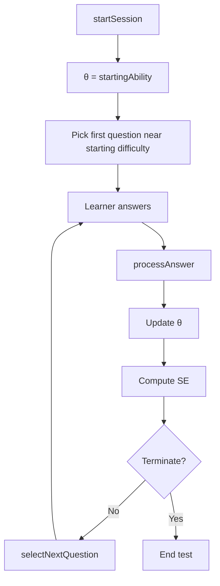

# Section-2 — Adaptive Engine Module

Standalone TypeScript implementation of the **Rasch 1PL adaptive algorithm** described in Section 1 (`README.md` → _3. Adaptive Algorithm Design_). This package is a deterministic domain module containing only adaptive-testing logic. It has no dependency on databases, HTTP frameworks, session storage, or infrastructure concerns.

## Quick start

```bash
cd adaptive-engine
npm install
npm test
npm run build
```

| Command         | Purpose                         |
| --------------- | ------------------------------- |
| `npm test`      | Run Vitest unit tests           |
| `npm run build` | Emit `dist/` for library import |

## How it works

The `adaptive-engine` package is the **brain of adaptive testing** from the [`Adaptive LMS - System Design Documentation`](../README.md): it estimates how skilled a learner is (θ), picks the next question, and decides when the test can stop. It does that with **pure functions** only. A real LMS would call it from the Test Service after loading session state and a question pool.

### What problem it solves

In a fixed test, everyone gets the same questions. In an **adaptive** test, each learner gets questions near their estimated ability so you learn more from fewer items. This module implements that logic using the **Rasch 1PL model**:

- **θ (theta)** - latent learner ability (e.g. -4 beginner … +4 expert)
- **b** - question difficulty on the **same scale** as θ
- **P(correct)** - probability they get it right: $\frac{1}{1 + e^{-(\theta - b)}}$

### Core state

```typescript
AdaptiveState {
  theta: number;              // current ability estimate
  answered: AnsweredItem[]; // history: id, difficulty, correct/incorrect
}
```

The caller (session layer) persists this in PostgreSQL/Redis. The engine only returns an updated copy.

**Config** (`AdaptiveConfig`) mirrors test settings from the design doc: learning rate (0.3), max step (0.75), ability bounds (±4), max questions (40), SE stop threshold (0.2), Top-N randomization (20), and more. See `DEFAULT_ADAPTIVE_CONFIG` in `src/types.ts`.

### Lifecycle: two main entry points



#### 1. `startSession(candidates, startingDifficulty, config)`

- Creates `{ theta: startingAbility, answered: [] }`
- Picks the **first question** closest to `startingDifficulty` among published, under-exposure items
- Uses **Top-N randomization**: take the N closest matches, then pick one at random (reduces everyone getting the same first item)

#### 2. `processAnswer(state, questionId, difficulty, correct, candidates, config)`

One answer → one full step:

1. **No-repeat** — throws if `questionId` was already in `answered`
2. **Update θ** — damped Rasch update (see below)
3. **Append** response to history
4. **Standard error** — how confident we are in θ
5. **Termination** — stop if SE is low enough or max questions hit
6. **Next question** — unless terminating; if pool is empty → terminate with `no_eligible_questions`

### Ability update (why θ does not swing wildly)

After one response, a naive update can jump θ by +2 after a single correct medium question. The design uses three guards:

```text
P = Rasch probability at current θ and item difficulty b
I = P × (1 − P)                    // how informative this item is
raw = (u − P) / max(I, 0.05)       // u = 1 correct, 0 incorrect
step = clamp(learningRate × raw, -maxStepSize, +maxStepSize)
θ_new = clamp(θ_old + step, minAbility, maxAbility)
```

```text
Example defaults:

learningRate = 0.3
maxStepSize = 0.75
minAbility = -4
maxAbility = +4
```

- **Damping (0.3)** — small steps per question
- **Step cap (0.75)** — one answer cannot move θ more than 0.75
- **Bounds (±4)** — no infinite ability

Correct on an easy question (θ ≫ b) barely moves θ; correct on a matched question moves it more.

### Question selection (maximum information + safety)

Strategy from the design doc: **pick difficulty closest to current θ** (maximum information when θ ≈ b).

Filters:

- Not already answered (**no-repeat invariant**)
- `status === "published"`
- `exposureCount < maxExposure`

Then sort by `|θ − difficulty|`, take the best **N** (`randomizationN`), pick one at random. If nothing matches, **fallback** widens to any remaining eligible question.

### When the test stops

1. **Confidence** — `SE < terminationSeThreshold` (default 0.20) → estimate is precise enough to stop early
2. **Length** — `questions_answered >= maxQuestions` (default 40)
3. **Pool exhausted** — no eligible questions left

Test termination occurs when the first termination condition is satisfied:

- SE < terminationSeThreshold
- questionsAnswered >= maxQuestions
- no eligible questions remain

### What this package does not do

- Store sessions, JWTs, or idempotency
- Increment exposure counters (caller does that when serving a question)
- Load questions from a DB (caller passes `QuestionCandidate[]`)
- Proctoring or HTTP

That keeps the module testable and reusable: **input state + pool → output state + optional next question**.

### Summary

**Each answer nudges θ up or down based on whether the outcome was surprising for that difficulty; SE measures certainty; selection always tries to serve a question near θ without repeating or over-exposing items; termination fires when you are confident enough or out of questions.**

## Module layout

| File             | Responsibility                                  |
| ---------------- | ----------------------------------------------- |
| `rasch.ts`       | P(correct), item information, SE, 95% CI        |
| `ability.ts`     | Damped, clamped θ update after each answer      |
| `selection.ts`   | Top-N randomization, exposure filter, no-repeat |
| `termination.ts` | `max_questions` and SE threshold rules          |
| `engine.ts`      | `startSession`, `processAnswer` orchestration   |
| `types.ts`       | Types, defaults, product difficulty 1–10 ↔ IRT  |

Product-scale difficulty **1–10** maps linearly to IRT **b** in `[-4, +4]` via `productDifficultyToIrt()` / `irtToProductDifficulty()`.

## Plugging into session management

In production, the **Test Service** owns `TestSession` rows (θ, SE, answered IDs). This module is invoked inside the **Submit Answer → Get Next Question** hot path:

```text
1. Test Service loads session + test config (learning_rate, max_questions, …).
2. Question Service returns candidate pool (published, under exposure).
3. processAnswer(state, questionId, b, isCorrect, candidates, config)
      → updated θ, SE, termination flag, optional next question.
4. Test Service persists state in PostgreSQL / Redis and returns API payload.
```

Example integration sketch (pseudocode):

```typescript
import {
  startSession,
  processAnswer,
  productDifficultyToIrt,
  DEFAULT_ADAPTIVE_CONFIG,
} from "@lms/adaptive-engine";

// POST /tests/{id}/sessions
const { state, firstQuestion } = startSession(
  questionPool,
  test.startingDifficulty,
  adaptiveConfig,
);

// POST /sessions/{id}/answers
const result = processAnswer(
  session.adaptiveState,
  body.questionVersionId,
  question.difficulty, // already calibrated IRT b
  body.isCorrect,
  eligiblePool,
  adaptiveConfig,
);

if (result.termination.shouldTerminate) {
  await completeSession(sessionId, result.state);
} else {
  await saveSession(sessionId, result.state, result.nextQuestion);
}
```

**Boundaries of this package**

- Does **not** assign JWTs, idempotency keys, or row locks (Section 1.5). Replay protection, idempotency validation, and session locking are handled by the **Test Service** and are intentionally outside the scope of this package.
- Does **not** increment `exposure_count` - the caller updates that after delivery. The adaptive engine only reads exposure metadata supplied by the caller. Ownership of `exposure_count` updates remains with the **Question Service**.
- Does **not** stream video or touch proctoring.

Those concerns stay in the API gateway, auth service, question service, and proctoring subsystem; this module only implements statistically grounded selection and ability estimation.

## Test coverage

| Area                | Test file             |
| ------------------- | --------------------- |
| Rasch / information | `rasch.test.ts`       |
| Damped updates      | `ability.test.ts`     |
| θ convergence       | `convergence.test.ts` |
| Difficulty 1 & 10   | `boundaries.test.ts`  |
| Termination         | `termination.test.ts` |
| No-repeat           | `no-repeat.test.ts`   |


## Quality Assurance

Vitest test suite:

- 23 tests
- 6 test files
- Statement coverage: 82.6%
- Branch coverage: 81.8%
- Line coverage: 82.6%

Coverage report can be generated using:

`npm run test:coverage`